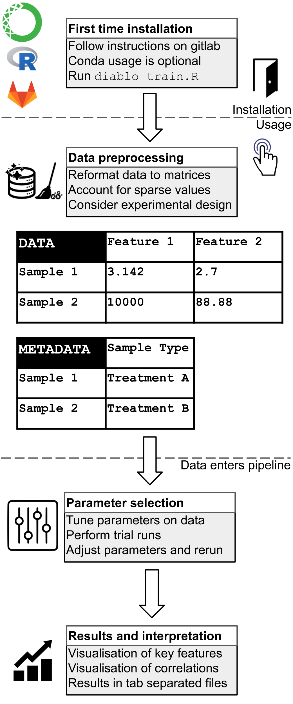

[](https://doi.org/10.5281/zenodo.4562010)
[](https://opensource.org/licenses/MIT)
[](https://hub.docker.com/repository/docker/tyronechen/multiomics)
[](https://gitlab.com/tyagilab/sars-cov-2)
[](https://twitter.com/tyagilab)

# SARS-CoV-2

> **NOTE**: The pipeline API has changed since the original publication. To reproduce the results in the original COVID-19 paper, please use the specific version of the pipeline available on zenodo. Please refer to case study 3 for latest usage.

> **NOTE**: The [main repository has been moved to github](https://github.com/tyronechen/SARS-CoV-2). It is [also mirrored on gitlab](https://gitlab.com/tyagilab/sars-cov-2) but please submit any issues to the main gitlab repository only.

Copyright (c) 2020 <a href="https://orcid.org/0000-0002-9207-0385">Tyrone Chen </a>, <a href="https://orcid.org/0000-0002-0827-866X">Melcy Philip </a>, <a href="https://orcid.org/0000-0002-4146-2848">Al J Abadi </a>, <a href="https://orcid.org/0000-0003-3923-1116">Kim-Anh Lê Cao </a>, <a href="https://orcid.org/0000-0003-0181-6258">Sonika Tyagi </a>

Code in this repository is provided under a [MIT license](https://opensource.org/licenses/MIT). This documentation is provided under a [CC-BY-3.0 AU license](https://creativecommons.org/licenses/by/3.0/au/).

[Visit our lab website here.](https://bioinformaticslab.erc.monash.edu/) Contact Sonika Tyagi at [sonika.tyagi@rmit.edu.au](mailto:sonika.tyagi@rmit.edu.au).

This work was presented at the [ABACBS (Australian Bioinformatics and Computational Biology Society) Conference 2020](https://doi.org/10.7490/F1000RESEARCH.1118362.1), winning the best asynchronous talk award.

You can cite this pipeline as:

- Chen, Tyrone, Philip, Melcy, Lê Cao, Kim-Anh, & Tyagi, Sonika. A multi-modal data harmonisation approach for discovery of COVID-19 drug targets, Briefings in Bioinformatics, 2021;, bbab185, https://doi.org/10.1093/bib/bbab185
- Chen, Tyrone, Philip, Melcy, Abadi, Al J, Lê Cao, Kim-Anh, & Tyagi, Sonika. (2021, March 4). Multi-omics data harmonisation for the discovery of COVID-19 drug targets. Zenodo. http://doi.org/10.5281/zenodo.4562010

```
@article{10.1093/bib/bbab185,
    author     = {Chen, Tyrone and
                  Philip, Melcy and
                  Lê Cao, Kim-Anh and
                  Tyagi, Sonika},
    title      = "{A multi-modal data harmonisation approach
                   for discovery of COVID-19 drug targets}",
    journal    = {Briefings in Bioinformatics},
    year       = {2021},
    month      = {05},
    issn       = {1477-4054},
    doi        = {10.1093/bib/bbab185},
    url        = {https://doi.org/10.1093/bib/bbab185},
    note       = {bbab185},
    eprint     = {https://academic.oup.com/bib/advance-article-pdf/doi/10.1093/bib/bbab185/38130519/bbab185.pdf},
}

@software{chen_tyrone_2021_4562010,
  author       = {Chen, Tyrone and
                  Philip, Melcy and
                  Abadi, Al J and
                  Lê Cao, Kim-Anh and
                  Tyagi, Sonika},
  title        = {{Multi-omics data harmonisation for the discovery
                   of COVID-19 drug targets}},
  month        = mar,
  year         = 2021,
  publisher    = {Zenodo},
  doi          = {10.5281/zenodo.4562010},
  url          = {https://doi.org/10.5281/zenodo.4562010}
}
```

## Overview of the pipeline

This pipeline ingests data in the format of at least two matrices, each corresponding to individual omics data. In the matrices, samples correspond to rows and features to columns.

Sample input data:

|                 | Feature1         | Feature2         |
|-----------------|------------------|------------------|
| Sample1         | 3.142            | 2.7              |
| Sample2         | 10000            | 88.88            |

Metadata is provided as a table of sample types. Data is expected to be tab-separated, cleaned, preprocessed and be non-sparse.

Sample input metadata:

|                 | Sample Type      |
|-----------------|------------------|
| Sample1         | TreatmentA       |
| Sample2         | TreatmentB       |

Initial parameters are provided by the user and further tuned during data processing. Results are output as a series of plots in a `pdf` file, and a series of tab separated `txt` files for any downstream analyses.

Regarding experimental design, if repeated measurements are involved, this information can be provided to the pipeline which will attempt to correct for this effect.

Sample input metadata (repeated measurements):

|                 | Sample Type      |
|-----------------|------------------|
| Sample1         | PatientX         |
| Sample2         | PatientY         |

A visual summary of the pipeline is below:



## Contents:

[[_TOC_]]

### [Introduction and install instructions](introduction.md)

> **NOTE**: The pipeline API has changed since the original publication. To reproduce the results in the original COVID-19 paper, please use the specific version of the pipeline available on zenodo for case studies 1 and 2 only.

### [(Ref only) Case study 1](case_study_1.md)

### [(Ref only) Case study 2](case_study_2.md)

### [Case study 3](case_study_3.md)

### Downstream analyses

#### Parsing the output

> **NOTE**: This section describes the downstream steps performed in our publication and is not directly a part of the pipeline.

To annotate and organise correlation tables for further analysis, run the jupyter notebooks associated with the respective case studies `src/case_study_1`, `src/case_study_2`.

#### Molecular docking analyses

Molecular docking analyses were carried out with four docking tools [SWISSDOCK](http://www.swissdock.ch/), [PATCHDOCK](https://bioinfo3d.cs.tau.ac.il/PatchDock/), [MTiAutoDock](https://bioserv.rpbs.univ-paris-diderot.fr/services/MTiOpenScreen/) and [Achilles Blind Docking](https://bio-hpc.ucam.edu/achilles/). In each case, the web server was used. Each docking tool applies a different strategy. For detailed information on the strategies used, please refer to the source manuscripts cited in the publication.

A consensus result among all the four tools was used to obtain increased layers of confidence in the final results. To illustrate drug viability in human physiological environments, *in silico* pharmacokinetic analysis of the drugs was done by analysing their ADME properties (absorption, distribution, metabolism and excretion) with the [admetSAR tool](http://lmmd.ecust.edu.cn/admetsar2/).

## Acknowledgements

[We thank David A. Matthews](https://orcid.org/0000-0003-4611-8795) for helpful discussions and feedback. [We thank Yashpal Ramakrishnaiah](https://orcid.org/0000-0002-2213-8348) for performing an extended analysis of the primary data. [We thank Melcy Philip](https://orcid.org/0000-0002-0827-866X) for performing downstream analysis of the data. This work was supported by the [MASSIVE HPC facility](www.massive.org.au) and the authors thank the HPC team at Monash eResearch Centre for their continuous personnel support. This R package was compiled referring to information from blog posts or books by [Hilary Parker](https://hilaryparker.com/2014/04/29/writing-an-r-package-from-scratch/), [Fong Chun Chan](https://tinyheero.github.io/jekyll/update/2015/07/26/making-your-first-R-package.html), [Karl Broman](https://kbroman.org/pkg_primer/pages/data.html), [Yihui Xie, J. J. Allaire, Garrett Grolemund](https://bookdown.org/yihui/rmarkdown/) as well as [Jenny Bryan and Hadley Wickham](https://r-pkgs.org/). [We acknowledge and pay respects to the Elders and Traditional Owners of the land on which our 4 Australian campuses stand](https://www.monash.edu/indigenous-australians/about-us/recognising-traditional-owners).

> **NOTE**: References are listed in the introduction section.
