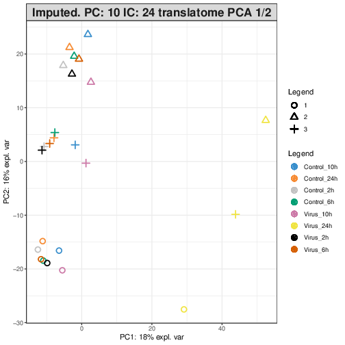
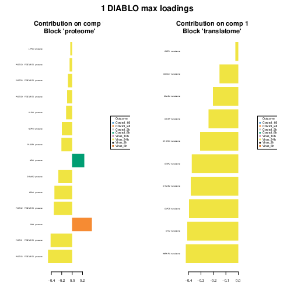

# SARS-CoV-2

*Copyright (c) 2020 [Tyrone Chen](https://orcid.org/0000-0002-9207-0385), [Kim-Anh Lê Cao](https://orcid.org/0000-0003-3923-1116), [Sonika Tyagi](https://orcid.org/0000-0003-0181-6258)*

*Code in this repository is provided under a MIT license. This documentation is provided under a CC-BY-3.0 AU license.*

*[Visit our lab website here.](https://bioinformaticslab.erc.monash.edu/)*

## Overview

Integrate multi-omics data for SARS-Cov-2. 2 modalities are used, proteome and translatome. Note that while classical translatome assays measure RNA attached to the ribosome, the authors use a custom method which measures nascent protein directly, so both datasets measure protein molecule abundances.

## Contents:

[[_TOC_]]

<!-- - Experimental design
- Data availability
- Software availability
- Method references
- Walkthrough
- Reproducing our results
- Acknowledgements -->

## Experimental design

n=3 for all classes:

| Infection state | Timepoint (hour) |
|-----------------|------------------|
| Control         | 2                |
| Control         | 6                |
| Control         | 10               |
| Control         | 24               |
| Infected        | 2                |
| Infected        | 6                |
| Infected        | 10               |
| Infected        | 24               |


## Data availability

- [Bojkova, D., Klann, K., Koch, B. et al. Proteomics of SARS-CoV-2-infected host cells reveals therapy targets. Nature 583, 469–472 (2020). https://doi.org/10.1038/s41586-020-2332-7](https://doi.org/10.1038/s41586-020-2332-7)
- [Supp table 1](https://static-content.springer.com/esm/art%3A10.1038%2Fs41586-020-2332-7/MediaObjects/41586_2020_2332_MOESM2_ESM.xlsx)
- [Supp table 2](https://static-content.springer.com/esm/art%3A10.1038%2Fs41586-020-2332-7/MediaObjects/41586_2020_2332_MOESM3_ESM.xlsx)

## Software availability

```
python 3.8.2
  jupyter-notebook 1.0.0
  pandas 1.0.2

R 3.6.2
  argparser 0.6
  igraph_1.2.5
  mixOmics 6.13.3
```

## Method references

- [Amrit Singh, Casey P Shannon, Benoît Gautier, Florian Rohart, Michaël Vacher, Scott J Tebbutt, Kim-Anh Lê Cao, DIABLO: an integrative approach for identifying key molecular drivers from multi-omics assays, Bioinformatics, Volume 35, Issue 17, 1 September 2019, Pages 3055–3062, https://doi.org/10.1093/bioinformatics/bty1054](https://doi.org/10.1093/bioinformatics/bty1054)
- [H.M. Blalock, A. Aganbegian, F.M. Borodkin, Raymond Boudon, Vittorio Capecchi. Path Models with Latent Variables: The NIPALS Approach. In International Perspectives on Mathematical and Statistical Modeling  (1975). https://doi.org/10.1016/B978-0-12-103950-9.50017-4](https://doi.org/10.1016/B978-0-12-103950-9.50017-4)
- [Liquet, B., Cao, K.L., Hocini, H. et al. A novel approach for biomarker selection and the integration of repeated measures experiments from two assays. BMC Bioinformatics 13, 325 (2012). https://doi.org/10.1186/1471-2105-13-325](https://doi.org/10.1186/1471-2105-13-325)
- [Rohart F, Gautier B, Singh A, Lê Cao KA (2017) mixOmics: An R package for ‘omics feature selection and multiple data integration. PLOS Computational Biology 13(11): e1005752. https://doi.org/10.1371/journal.pcbi.1005752](https://doi.org/10.1371/journal.pcbi.1005752)

## Walkthrough

### Reformatting the data for input into our pipeline

Before data enters the pipeline, we reformat it into an appropriate matrix of abundance measures. Steps taken can be viewed in the jupyter notebook `src/parse_data_for_diablo.ipynb`.

### Data quality control

To ensure that the data is suitable for testing our hypothesis, we assess the data with quality metrics before analysis.

We identified two issues:
- A high proportion of missing values within the translatome data
- Unwanted variation possibly caused by the longitudinal study design

#### Accounting for missing values

We discovered a high proportion of missing values within the **translatome** data.

| Proteome | Translatome |
|----------|-------------|
| Proportion of NA values (of 24 samples) for each variable present in the proteome data. | Proportion of NA values (of 24 samples) for each variable present in the translatome data. |
|  |  |

We corrected for the missing values in the translatome data (~47% of original data) by a mixture of filtering and imputation. We considered that filtering alone would be too aggressive and imputation alone would be ineffective.

Filtering was performed by dropping all protein features which were not represented across each biological sample group.

| Infection state | Timepoint (hour) | Var1 (Keep) | Var2  (Filter) |
|-----------------|------------------|------|--------|
| Control         | 2                | 2    | 0      |
| Control         | 2                | 0    | 0      |
| Control         | 2                | 5    | 0      |
| Control         | 6                | 1    | 3      |
| Control         | 6                | 3    | 4      |
| Control         | 6                | 2    | 9      |
| ...             | ...              | ...  | ...    |

This reduced the quantity of missing values to ~17% of the original data. An imputation was performed with the [NIPALS algorithm](https://doi.org/10.1016/B978-0-12-103950-9.50017-4), which is effective on data with < 20% missing values.

> _**NOTE**_: [Here is an example use case of the imputation.](http://mixomics.org/methods/missing-values/)

In the case of proteomics data, < 0.01% of the dataset consisted of missing values. These few values were imputed with the same procedure applied on the translatome data for consistency. No filtering was required as all proteins were represented in each sample group.

> _**NOTE**_: Filtering alone would have removed about 47% of the data along with potential signal, while imputing alone would not be effective on this level of missing values. Therefore, we filtered missing values to reduce it to 17% of the dataset and imputed the remaining. NIPALS is effective on datasets with < 20% missing values.

To test that imputation has not introduced significant technical variation into the data, we observe the correlation between variates of the principal components.

| Proteome | Translatome |
|----------|-------------|
| Before imputation: PCA of proteome data with NA values | Before imputation: PCA of translatome data with NA values |
|  |  |
| After imputation: PCA of proteome data with imputed values | After imputation: PCA of translatome data with imputed values |
|  |  |
| Correlation of proteome PCA variates with NA values | Correlation of translatome PCA variates with NA values |
|  |  |

In both cases, there is a strong correlation between the variates on at least the first 5 principal components corresponding to at least 50% of the variation in the data.

> _**NOTE**_: In this case, either strong positive or strong negative correlations indicate similarity (directionality not important).

#### Accounting for unwanted variation

We observed a "sample effect" in the data, which is likely caused by the longitudinal study design, where sets of cell cultures were resampled over a time series.

| Proteome | Translatome |
|----------|-------------|
| After imputation: PCA of proteome data with imputed values | After imputation: PCA of translatome data with imputed values |
|  |  |

We show that we can account for this unwanted variation with a [multilevel decomposition](https://bmcbioinformatics.biomedcentral.com/articles/10.1186/1471-2105-13-325).

| Proteome | Translatome |
|----------|-------------|
| After imputation and multilevel decomposition: PCA of proteome data with imputed values and multilevel decomposition | After imputation and multilevel decomposition: PCA of translatome data with imputed values and multilevel decomposition |
|  |  |

> _**NOTE**_: [Here is an example use case of the multilevel decomposition.](http://mixomics.org/methods/multilevel/)

<!-- will we need to address single omics analysis -->

### Single omics analysis

We next apply the sPLSDA (sparse Partial Least Squares Discriminant Analysis) method for each block of single-omics data, and as before internally perform a multilevel decomposition to account for the repeated measurements within each cell culture.

> _**NOTE**_: [Here is an example use case of sPLSDA](http://mixomics.org/case-studies/splsda-srbct/)

#### Parameter tuning

To investigate the parameters best suited for the methods, leave-one-out cross validation was performed. The balanced classification error rate across multiple components for maximum, centroids and mahalanobis distance are plotted. At the same time, the number of components and features selected were tuned internally with a function in the mixOmics package.

| Proteome | Translatome |
|----------|-------------|
| Balanced error rate per sPLSDA component. Centroids distance metric with 4 components appears to be the most effective. | Balanced error rate per sPLSDA component. Centroids distance metric with 4 components appears to be the most effective. |
|  |  |
| Balanced error rate per number of features. 4 components appears to be the most effective. | Balanced error rate per number of features. 4 components appears to be the most effective. |
|  |  |

To assess method performance, a ROC curve was also plotted. However, this may be less effective in determining performance due to the nature of the sPLSDA algorithm.

| Proteome | Translatome |
|----------|-------------|
| ROC curve for sPLSDA classification accuracy on sPLSDA component 1. This metric is less effective in context of the sPLSDA algorithm. | ROC curve for sPLSDA classification accuracy on sPLSDA component 1. This metric is less effective in context of the sPLSDA algorithm. |
|  |  |

It is also possible to view the stability of the selected variables.

| Proteome | Translatome |
|----------|-------------|
| Stability of the selected variables on sPLSDA component 1 | Stability of the selected variables on sPLSDA component 1 |
|  |  |

To screen data, arrow plots and correlation circle plots are also useful. The arrow plots display samples spanned by components of the sPLSDA, with arrows indicating the location of the individual categories.

<!-- The correlation circle plots highlight the contribution of each variable to each component. A strong correlation between variables is indicated by clusters of points. -->

| Proteome | Translatome |
|----------|-------------|
| sPLSDA arrow plots | sPLSDA arrow plots |
|  |  |
<!-- | sPLSDA correlation circle plots | sPLSDA correlation circle plots |
|  |  | -->

#### Results

Plotting the first few components of the sPLSDA reveals several distinct sample groups, with the main distinction in both omics data blocks as the difference between late stage infected samples with all other samples. This matches the independent observations of the laboratory which originally generated the data. There are multiple secondary distinctions between data groups in both omics data blocks, mostly between groups of timepoints. It is also interesting to note that some sub-groups of data include both infected and uninfected samples.

| Proteome | Translatome |
|----------|-------------|
| sPLSDA proteome component 1/2. Both components account for ~34% of variation in the data. | sPLSDA translatome component 1/2. Both components account for ~34% of variation in the data. |
|  |  |
| sPLSDA proteome clustered image map with features plotted as the horizontal axis and samples on the vertical axis. Colours on the vertical axis indicate sam-ple class and sample source. | sPLSDA translatome clustered image map with features plotted as the horizontal axis and samples on the vertical axis. Colours on the vertical axis indicate sam-ple class and sample source. |
|  |  |
| The top loadings for the first component are visualised in the proteome dataset. These correspond to the variables in each dataset which contribute the most to variation. The biological outcome they most contribute to are coloured. | The top loadings for the first component are visualised in the translatome dataset. These correspond to the variables in each dataset which contribute the most to variation. The biological outcome they most contribute to are coloured. |
|  |  |

To supplement the sPLSDA, we also compared the performance of PLSDA (a non sparse variant of sPLSDA keeping all features). This showed similarities in patterns across the datasets (not shown). Parameter tuning was carried out as with sPLSDA (not shown).

<!-- | Proteome | Translatome |
|----------|-------------|
| PLSDA proteome component 1/2. Both components account for ~34% of variation in the data. | PLSDA translatome component 1/2. Both components account for ~34% of variation in the data. |
|  |  |
| PLSDA proteome clustered image map with features plotted as the horizontal axis and samples on the vertical axis. Colours on the vertical axis indicate sam-ple class and sample source. | PLSDA translatome clustered image map with features plotted as the horizontal axis and samples on the vertical axis. Colours on the vertical axis indicate sam-ple class and sample source. |
|  |  |
| The top loadings for the first component are visualised in the proteome dataset. These correspond to the variables in each dataset which contribute the most to variation. The biological outcome they most contribute to are coloured. | The top loadings for the first component are visualised in the translatome dataset. These correspond to the variables in each dataset which contribute the most to variation. The biological outcome they most contribute to are coloured. |
|  |  | -->

> _**NOTE**_: [Here is an example use case of PLSDA](http://mixomics.org/methods/pls-da/)

### Multi omics analysis

Having assessed the major sources of variation and features of interest contributing to biological conditions within the individual blocks of omics data, we used this information to guide our multi-omics integration.

#### Parameter tuning


#### Results

We applied a latent variable approach to identify a highly correlated multi-omics signature. This analysis is carried out in a conceptually similar way to the previous sPLSDA with similar parameter requirements, except with multiple omics data blocks corrected for longitudinal study effects specified as input. We illustrate the correlation between features across these omics blocks with a circos plot.

| Multiomics |
|------------|
|  Multiblock sPLSDA component 1/2 |
|  |
|  Multiblock sPLSDA clustered image map |
|  |
| The top loadings for the first component are visualised. These correspond to the variables in each dataset which contribute the most to variation. The biological outcome they most contribute to are coloured. |
|  |
| Circos plot, built on a similarity matrix demonstrates the correlation between different proteins and transcripts, with a visualisation cutoff of 0.95 correlation score. Positive correlations are in red and negative correlations are in blue. Proteome block is in blue and translatome block is in green. Line graphs on the outside of the circos plot represent expression levels of their corresponding features, and are coloured by their biological sample class. |
|  |

## Reproducing our results

The complete data object generated by this code and used in the publication can be accessed by loading the provided `RData` file within an R environment.

```
load("results/results.RData")
```

Alternatively, a complete run can be made by running the following command:

*TODO: update paths*

```
Rscript diablo_train.R \
   ../data/classes_diablo.txt  \
   --classes_secondary ../data/pch.txt \
   --dropna_classes TRUE \
   --dropna_prop 0 \
   --data ../data/diablo_proteome.txt ../data/diablo_translatome.txt \
   --ncpus 6 \  # edit this depending on how many cpus you have
   --diablocomp 0 \
   --diablo_keepx 5 10 12 14 16 18 20 30 \
   --icomp 24 \
   --pcomp 10 \
   --plsdacomp 4 \
   --splsdacomp 4 \
   --splsda_keepx 10 25 50 100 \
   --dist_splsda centroids.dist \
   --dist_diablo mahalanobis.dist \
   --contrib max \
   --outfile_dir ../results/test_run \
   --rdata RData.RData \
   --plot Rplots.pdf \
   --args Rscript.sh
```

Note that this may yield slightly different results, as the algorithm is not deterministic. As of `R >=3.6`, setting seeds will not replicate results across different `R` versions.

## Acknowledgements

[We thank Kim-Anh Lê Cao](https://lecao-lab.science.unimelb.edu.au/) for contributions to the code and analysis.
