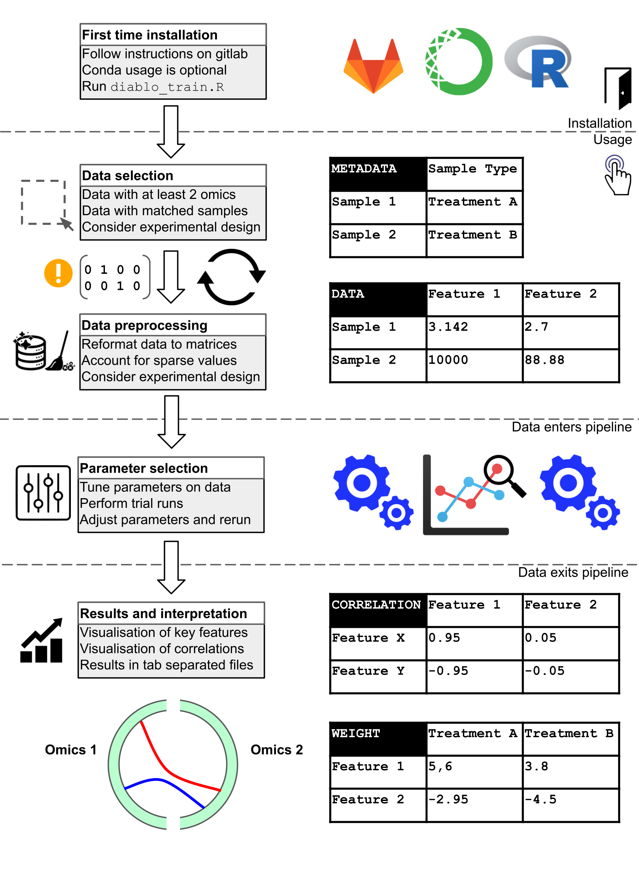
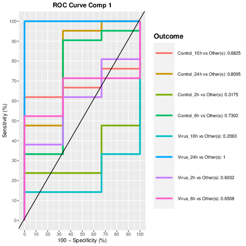

[](https://opensource.org/licenses/MIT)

# SARS-CoV-2

Copyright (c) 2020 <a href="https://orcid.org/0000-0002-9207-0385">Tyrone Chen </a>, <a href="https://orcid.org/0000-0003-3923-1116">Kim-Anh Lê Cao </a>, <a href="https://orcid.org/0000-0002-9207-0385">Sonika Tyagi </a>

Copyright (c) 2020 [Tyrone Chen](https://orcid.org/0000-0002-9207-0385), [Kim-Anh Lê Cao](https://orcid.org/0000-0003-3923-1116), [Sonika Tyagi](https://orcid.org/0000-0003-0181-6258)

<div itemscope itemtype="https://schema.org/Person"><a itemprop="sameAs" content="https://orcid.org/0000-0002-9207-0385" href="https://orcid.org/0000-0002-9207-0385" target="orcid.widget" rel="me noopener noreferrer" style="vertical-align:top;">Tyrone Chen</a></div>
<div itemscope itemtype="https://schema.org/Person"><a itemprop="sameAs" content="https://orcid.org/0000-0003-3923-1116" href="https://orcid.org/0000-0003-3923-1116" target="orcid.widget" rel="me noopener noreferrer" style="vertical-align:top;">Kim-Anh Lê Cao</a></div>
<div itemscope itemtype="https://schema.org/Person"><a itemprop="sameAs" content="https://orcid.org/0000-0003-0181-6258" href="https://orcid.org/0000-0003-0181-6258" target="orcid.widget" rel="me noopener noreferrer" style="vertical-align:top;">Sonika Tyagi</a></div>

Code in this repository is provided under a [MIT license](https://opensource.org/licenses/MIT). This documentation is provided under a [CC-BY-3.0 AU license](https://creativecommons.org/licenses/by/3.0/au/).

[Visit our lab website here.](https://bioinformaticslab.erc.monash.edu/) Contact Sonika Tyagi at [sonika.tyagi@monash.edu](mailto:sonika.tyagi@monash.edu).

This work was presented at the [ABACBS (Australian Bioinformatics and Computational Biology Society) Conference 2020](https://doi.org/10.7490/F1000RESEARCH.1118362.1), winning the best asynchronous talk award.

Future work will involve the application of deep learning to better identify latent patterns in high dimensional data. [An example of some of our preliminary work on this topic is available here.](https://gitlab.com/tyagilab/integrativeepigenomics)

## Overview of the pipeline

This pipeline ingests data in the format of at least two matrices, each corresponding to individual omics data. In the matrices, samples correspond to rows and features to columns.

Sample input data:

|                 | Feature1         | Feature2         |
|-----------------|------------------|------------------|
| Sample1         | 3.142            | 2.7              |
| Sample2         | 10000            | 88.88            |

Metadata is provided as a table of sample types. Data is expected to be tab-separated, cleaned, preprocessed and be non-sparse.

Sample input metadata:

|                 | Sample Type      |
|-----------------|------------------|
| Sample1         | TreatmentA       |
| Sample2         | TreatmentB       |

Initial parameters are provided by the user and further tuned during data processing. Results are output as a series of plots in a `pdf` file, and a series of tab separated `txt` files for any downstream analyses.

Regarding experimental design, if repeated measurements are involved, this information can be provided to the pipeline which will attempt to correct for this effect.

Sample input metadata (repeated measurements):

|                 | Sample Type      |
|-----------------|------------------|
| Sample1         | PatientX         |
| Sample2         | PatientY         |

A visual summary of the pipeline is below:



## Contents:

<!-- This directive renders a table of contents in `gitlab` but may not work elsewhere! -->

[[_TOC_]]

<!-- - Experimental design
- Data availability
- Software availability
- Method references
- Walkthrough
- Reproducing our results
- Acknowledgements -->

## Installation

### Gitlab

You can install this directly as an R package from gitlab:

```
install.packages(devtools)
install_gitlab("tyagilab/sars-cov-2", subdir="multiomics")
```

The actual script used to run the pipeline is not directly callable but provided as a separate script.

```
# this will show you the path to the script
system.file("scripts", "run_pipeline.R", package="multiomics")
```

### Git clone

Alternatively, clone the git repository with:

```
git clone "https://gitlab.com/tyagilab/sars-cov-2.git"
```

#### Install R packages with conda

[With conda](https://bioconda.github.io/user/install.html) (recommended):

```
conda config --add channels defaults
conda config --add channels bioconda
conda config --add channels conda-forge

conda create -n my_environment install \
  r-argparser \
  r-brio \
  r-colorspace \
  r-diffobj \
  r-dplyr \
  r-ellipsis \
  r-farver \
  r-ggplot2 \
  r-ggrepel \
  r-igraph \
  r-isoband \
  r-matrixStats \
  r-mixOmics \
  r-parallel \
  r-plyr \
  r-rARPACK \
  r-Rcpp \
  r-RcppEigen \
  r-reshape2 \
  r-RSpectra \
  r-stringi \
  r-testthat \
  r-tibble \
  r-tidyr \
  r-utf8 \
  r-vctrs \
  r-zeallot
```

#### Install R packages with R

Manual install (within R):

```
install_me <- c(
  "argparser", "brio", "colorspace", "diffobj", "dplyr", "ellipsis", "farver",
  "ggplot2", "ggrepel", "igraph", "isoband", "matrixStats", "mixOmics",
  "parallel", "plyr", "rARPACK", "Rcpp", "RcppEigen", "reshape2", "RSpectra",
  "stringi", "testthat", "tibble", "tidyr", "utf8", "vctrs", "zeallot"
  )
sapply(install_me, install.packages)

## install BiocManager if not installed
if (!requireNamespace("BiocManager", quietly = TRUE))
    install.packages("BiocManager")
## ensure the following returns TRUE, or follow guidelines
BiocManager::valid()

## install mixOmics (latest stable version)
BiocManager::install("mixOmicsTeam/mixOmics")
```

> **NOTE:** You can also install the development version of [mixOmics by following the instructions on their website](http://mixomics.org/install/).

You can then run the script directly:

```
Rscript run_pipeline.R -h
```

For a sample submission script, see `[test_run.sh]`(https://gitlab.com/tyagilab/sars-cov-2/-/blob/master/src/test_run.sh). This example may take a few minutes to run.

> _**NOTE**_: `R` should be version 3.6 or greater. `multiomics_pipeline.R` and `run_pipeline.R` should be in the same directory.

## Overview of the case study

We apply this pipeline to a small example where we integrate multi-omics data for SARS-Cov-2. 2 modalities are used, proteome and translatome. Note that while classical translatome assays measure RNA attached to the ribosome, the authors use a custom method which measures nascent protein directly, so both datasets measure protein molecule abundances.

## Experimental design

n=3 for all classes:

| Infection state | Timepoint (hour) |
|-----------------|------------------|
| Control         | 2                |
| Control         | 6                |
| Control         | 10               |
| Control         | 24               |
| Infected        | 2                |
| Infected        | 6                |
| Infected        | 10               |
| Infected        | 24               |


## Data availability

- [Bojkova, D., Klann, K., Koch, B. et al. Proteomics of SARS-CoV-2-infected host cells reveals therapy targets. Nature 583, 469–472 (2020). https://doi.org/10.1038/s41586-020-2332-7](https://doi.org/10.1038/s41586-020-2332-7)
- [Supp table 1](https://static-content.springer.com/esm/art%3A10.1038%2Fs41586-020-2332-7/MediaObjects/41586_2020_2332_MOESM2_ESM.xlsx)
- [Supp table 2](https://static-content.springer.com/esm/art%3A10.1038%2Fs41586-020-2332-7/MediaObjects/41586_2020_2332_MOESM3_ESM.xlsx)

## Software availability

Python, pandas and jupyter notebooks are used as part of data preprocessing for this case study.

```
python 3.8.2
  jupyter-notebook 1.0.0
  pandas 1.0.2

R 3.6.3
  argparser 0.6
  igraph_1.2.5
  mixOmics 6.13.3
```

If you want to replicate the data preprocessing step, these can be installed with conda (recommended):

```
conda install jupyter-notebook pandas
```

Or pip:

```
pip install pandas
pip install jupyter-notebook
```


## Method references

- [Amrit Singh, Casey P Shannon, Benoît Gautier, Florian Rohart, Michaël Vacher, Scott J Tebbutt, Kim-Anh Lê Cao, DIABLO: an integrative approach for identifying key molecular drivers from multi-omics assays, Bioinformatics, Volume 35, Issue 17, 1 September 2019, Pages 3055–3062, https://doi.org/10.1093/bioinformatics/bty1054](https://doi.org/10.1093/bioinformatics/bty1054)
- [H.M. Blalock, A. Aganbegian, F.M. Borodkin, Raymond Boudon, Vittorio Capecchi. Path Models with Latent Variables: The NIPALS Approach. In International Perspectives on Mathematical and Statistical Modeling  (1975). https://doi.org/10.1016/B978-0-12-103950-9.50017-4](https://doi.org/10.1016/B978-0-12-103950-9.50017-4)
- [Liquet, B., Cao, K.L., Hocini, H. et al. A novel approach for biomarker selection and the integration of repeated measures experiments from two assays. BMC Bioinformatics 13, 325 (2012). https://doi.org/10.1186/1471-2105-13-325](https://doi.org/10.1186/1471-2105-13-325)
- [Rohart F, Gautier B, Singh A, Lê Cao KA (2017) mixOmics: An R package for ‘omics feature selection and multiple data integration. PLOS Computational Biology 13(11): e1005752. https://doi.org/10.1371/journal.pcbi.1005752](https://doi.org/10.1371/journal.pcbi.1005752)

## Walkthrough

To replicate our results, the original data object storing our results can be imported (see section: **Reproducing our results**). Figures can be replicated by following the code in the code blocks throughout this document.

### Data quality control

To ensure that the data is suitable for testing our hypothesis, we assess the data with quality metrics before analysis.

We identified two issues:
- A high proportion of missing values within the translatome data
- Unwanted variation possibly caused by the longitudinal study design

#### Accounting for missing values

We discovered a high proportion of missing values within the translatome data.

<details>
  <summary>Click to expand code block</summary>

  ```
  show_na_prop = function(data_na, name) {
    # first, sum the number of missing values per variable
    sum_na_per_var = apply(data_na, 2, function(x) {sum(is.na(x))})
    ​
    # show proportion of NA values across all samples (y) for a variable (x)
    plot(sum_na_per_var/nrow(data_na), type='h', xlab='variable index',
      ylab='NA proportion (across all samples for a variable)',
      main=paste(name, 'NA rate per variable on unfiltered data'))
  }
  mapply(function(x, y) show_na_prop(x, y), data, data_names, SIMPLIFY=FALSE)
  ```
</details>

<details>
  <summary>Click to expand figure block</summary>

  | Proteome | Translatome |
  |----------|-------------|
  | Proportion of NA values (of 24 samples) for each variable present in the proteome data. | Proportion of NA values (of 24 samples) for each variable present in the translatome data. |
  |  |  |

</details>

We corrected for the missing values in the translatome data (~47% of original data) by a mixture of filtering and imputation. We considered that filtering alone would be too aggressive and imputation alone would be ineffective.

Filtering was performed by dropping all protein features which were not represented across each biological sample group.

<details>
  <summary>Click to expand code block</summary>

  ```
  remove_na_class = function(data, classes, missing_as=NA) {
    # where there is NA for a whole class of features, remove feature column
    if (is.na(missing_as)) {
      data[is.na(data)] = 0
    } else {
      data[which(data == missing_as, arr.ind=TRUE)] = 0
    }
    print(dim(data))
    print("Dropping features where at least one class is NA")
    uniq = unique(classes)
    subsets = list()
    for (i in uniq) {subsets[[i]] = data[grep(i, rownames(data)), ]}
    subsets = lapply(lapply(lapply(subsets, colSums), data.frame), t)
    subsets = do.call("rbind", subsets)
    rownames(subsets) = uniq

    if (is.na(missing_as)) {
      subsets[which(subsets == 0, arr.ind=TRUE)] = NA
    } else {
      subsets[which(subsets == 0, arr.ind=TRUE)] = missing_as
    }

    subsets = t(na.omit(t(subsets)))
    data = data[, c(colnames(subsets))]

    if (is.na(missing_as)) {
      data[which(data == 0, arr.ind=TRUE)] = NA
    } else {
      data[which(data == 0, arr.ind=TRUE)] = missing_as
    }
    return(data)
  }
  ```
</details>

| Infection state | Timepoint (hour) | Var1 (Keep) | Var2  (Filter) |
|-----------------|------------------|------|--------|
| Control         | 2                | 2    | 0      |
| Control         | 2                | 0    | 0      |
| Control         | 2                | 5    | 0      |
| Control         | 6                | 1    | 3      |
| Control         | 6                | 3    | 4      |
| Control         | 6                | 2    | 9      |
| ...             | ...              | ...  | ...    |

This reduced the quantity of missing values to ~17% of the original data. An imputation was performed with the [NIPALS algorithm](https://doi.org/10.1016/B978-0-12-103950-9.50017-4), which is effective on data with < 20% missing values.

<details>
  <summary>Click to expand code block</summary>

  ```
  impute_missing_ = function(data, ncomp=10, block_name="") {
    # impute missing values with nipals: dataframe (with NA) -> dataframe
    print("Number of components for imputation:")
    print(ncomp)
    nipals_tune = nipals(data, reconst=TRUE, ncomp=ncomp)
    barplot(nipals_tune$eig, main=paste(block_name, "Screeplot (nipals imputed)"),
      xlab="Number of components", ylab="Explained variance"
    )
    return(nipals_tune$rec)
  }

  impute_missing = function(data, ncomps) {
    mapply(function(x, y, z) impute_missing_(x, y, z), data, ncomps, names(data))
  }

  data_imp = impute_missing(data, rep(argv$icomp, length(data)))
  data = replace_missing(data, data_imp)
  ```
</details>

> _**NOTE**_: [Here is an example use case of the imputation.](http://mixomics.org/methods/missing-values/)

In the case of proteomics data, < 0.01% of the dataset consisted of missing values. These few values were imputed with the same procedure applied on the translatome data for consistency. No filtering was required as all proteins were represented in each sample group.

> _**NOTE**_: Filtering alone would have removed about 47% of the data along with potential signal, while imputing alone would not be effective on this level of missing values. Therefore, we filtered missing values to reduce it to 17% of the dataset and imputed the remaining. NIPALS is effective on datasets with < 20% missing values.

To test that imputation has not introduced significant technical variation into the data, we observe the correlation between variates of the principal components.

<details>
  <summary>Click to expand code block</summary>

  ```
  plot_pca_single = function(data, classes, pch=NA, title="", ncomp=0, show=FALSE) {
    # do pca on individual classes: dataframe, vector, vector -> outfile_path.pdf
    names = names(data)

    print("Removing 0 variance columns from data...")
    data = lapply(data, remove_novar)

    if (ncomp == 0) {ncomp = dim(classes)[1]}

    data_pca = lapply(data, pca, ncomp=ncomp, center=TRUE, scale=TRUE)

    if (show == TRUE) {
      print("Showing PCA component contribution...")
      print(data_pca)
    }

    print("Plotting PCA component contribution...")
    mapply(function(x, y) plot(x, main=paste(y, "Screeplot")), data_pca, names)

    if (!is.na(pch)) {
      print("Plotting PCA by groups...")
      mapply(function(x, y) plotIndiv(x, comp=c(1,2), ind.names=FALSE,
        group=classes, legend=TRUE, ncomp=ncomp,
        title=paste(title, y, "PCA 1/2"), pch=pch), data_pca, names)
      mapply(function(x, y) plotIndiv(x, comp=c(1,3), ind.names=FALSE,
        group=classes, legend=TRUE, ncomp=ncomp,
        title=paste(title, y, "PCA 1/3"), pch=pch), data_pca, names)
      mapply(function(x, y) plotIndiv(x, comp=c(2,3), ind.names=FALSE,
        group=classes, legend=TRUE, ncomp=ncomp,
        title=paste(title, y, "PCA 2/3"), pch=pch), data_pca, names)
    } else {
      print("Plotting PCA by groups...")
      mapply(function(x, y) plotIndiv(x, comp=c(1,2), ind.names=TRUE,
        group=classes, legend=TRUE, ncomp=ncomp,
        title=paste(title, y, "PCA 1/2")), data_pca, names)
      mapply(function(x, y) plotIndiv(x, comp=c(1,3), ind.names=TRUE,
        group=classes, legend=TRUE, ncomp=ncomp,
        title=paste(title, y, "PCA 1/3"), pch=pch), data_pca, names)
      mapply(function(x, y) plotIndiv(x, comp=c(2,3), ind.names=TRUE,
        group=classes, legend=TRUE, ncomp=ncomp,
        title=paste(title, y, "PCA 2/3"), pch=pch), data_pca, names)
    }
    return(data_pca)
  }

  pca_impute = plot_pca_single(
    data_imp, classes, pch=pch, ncomp=argv$pcomp,
    title=paste("Imputed. PC:", argv$pcomp, "IC:", argv$icomp)
  )
  heatmaps = cor_imputed_unimputed(pca_withna, pca_impute, data_names)
  ```
</details>

<details>
  <summary>Click to expand figure block</summary>

  | Proteome | Translatome |
  |----------|-------------|
  | Before imputation: PCA of proteome data with NA values | Before imputation: PCA of translatome data with NA values |
  |  |  |
  | After imputation: PCA of proteome data with imputed values | After imputation: PCA of translatome data with imputed values |
  |  |  |
  | Correlation of proteome PCA variates with NA values | Correlation of translatome PCA variates with NA values |
  |  |  |

</details>

In both cases, there is a strong correlation between the variates on at least the first 5 principal components corresponding to at least 50% of the variation in the data.

> _**NOTE**_: In this case, either strong positive or strong negative correlations indicate similarity (directionality not important).

#### Accounting for unwanted variation

We observed a "sample effect" in the data, which is likely caused by the longitudinal study design, where sets of cell cultures were resampled over a time series.

<details>
  <summary>Click to expand code block</summary>

  ```
  # we assume the plot_pca_single() function in the previous code block is loaded

  pca_impute = plot_pca_single(
    data_imp, classes, pch=pch, ncomp=argv$pcomp,
    title=paste("Imputed. PC:", argv$pcomp, "IC:", argv$icomp)
  )
  ```
</details>

<details>
  <summary>Click to expand figure block</summary>

  | Proteome | Translatome |
  |----------|-------------|
  | After imputation: PCA of proteome data with imputed values | After imputation: PCA of translatome data with imputed values |
  |  |  |

</details>

We show that we can account for this unwanted variation with a [multilevel decomposition](https://bmcbioinformatics.biomedcentral.com/articles/10.1186/1471-2105-13-325).

<details>
  <summary>Click to expand code block</summary>

  ```
  plot_pca_multilevel = function(data, classes, pch, title="", ncomp=0, show=FALSE) {
    names = names(data)

    print("Removing 0 variance columns from data...")
    data = lapply(data, remove_novar)

    if (ncomp == 0) {ncomp = dim(classes)[1]}

    data_pca = lapply(data,pca,ncomp=ncomp,center=TRUE,scale=TRUE,multilevel=pch)
    if (show == TRUE) {
      print("Showing PCA multilevel component contribution...")
      print(data_pca)
    }

    print("Plotting PCA multilevel component contribution...")
    mapply(function(x, y) plot(x, main=paste(y, "Screeplot multilevel")),
      data_pca, names)

    print("Plotting PCA multilevel...")
    mapply(function(x, y) plotIndiv(x, comp=c(1,2), ind.names=FALSE,
      group=classes, legend=TRUE, ncomp=ncomp,
      title=paste(title, y, "PCA M 1/2"), pch=pch), data_pca, names)
    mapply(function(x, y) plotIndiv(x, comp=c(1,3), ind.names=FALSE,
      group=classes, legend=TRUE, ncomp=ncomp,
      title=paste(title, y, "PCA M 1/3"), pch=pch), data_pca, names)
    mapply(function(x, y) plotIndiv(x, comp=c(2,3), ind.names=FALSE,
      group=classes, legend=TRUE, ncomp=ncomp,
      title=paste(title, y, "PCA M 2/3"), pch=pch), data_pca, names)
    return(data_pca)
  }

  data_pca_multilevel = plot_pca_multilevel(
    input_data, classes, pch=pch, ncomp=argv$pcomp,
    title=paste("With NA. PC:", argv$pcomp)
  )

  data_pca_multilevel = plot_pca_multilevel(
    input_data, classes, pch=pch, ncomp=argv$pcomp,
    title=paste("Imputed. PC:", argv$pcomp, "IC:", argv$icomp)
  )
  ```
</details>

<details>
  <summary>Click to expand figure block</summary>

  | Proteome | Translatome |
  |----------|-------------|
  | After imputation and multilevel decomposition: PCA of proteome data with imputed values and multilevel decomposition | After imputation and multilevel decomposition: PCA of translatome data with imputed values and multilevel decomposition |
  |  |  |

</details>

> _**NOTE**_: [Here is an example use case of the multilevel decomposition.](http://mixomics.org/methods/multilevel/)

### Single omics analysis

We next apply the sPLSDA (sparse Partial Least Squares Discriminant Analysis) method for each block of single-omics data, and as before internally perform a multilevel decomposition to account for the repeated measurements within each cell culture.

> _**NOTE**_: [Here is an example use case of sPLSDA](http://mixomics.org/case-studies/splsda-srbct/)

#### Parameter tuning

To investigate the parameters best suited for the methods, leave-one-out cross validation was performed. The balanced classification error rate across multiple components for maximum, centroids and mahalanobis distance are plotted. At the same time, the number of components and features selected were tuned internally with a function in the mixOmics package.

<details>
  <summary>Click to expand code block</summary>

  ```
  # we want to tune splsda parameters (this will take a while!)
  # or you can just access the "tuned_splsda" object and skip this step

  tune_splsda = function(data, classes, names, multilevel, ncomp=3, nrepeat=10,
    logratio="none", test_keepX=c(5, 50, 100), validation="loo", folds=10,
    dist="centroids.dist", cpus=2, progressBar=TRUE) {
      mapply(function(x, y) tune_splsda_(x, classes, names, multilevel, ncomp,
        nrepeat, logratio, test_keepX, validation, folds, dist, cpus, progressBar),
        data, names, SIMPLIFY=FALSE)
    }

  tune_splsda_ = function(data, classes, names, multilevel, ncomp=0, nrepeat=10,
    logratio="none", test_keepX=c(5, 50, 100), validation="loo", folds=10,
    dist="centroids.dist", cpus=2, progressBar=TRUE) {
    if (ncomp == 0) {ncomp = (length(test_keepX))}
    # tune splsda components
    tuned = tune.splsda(data, Y=classes, multilevel=multilevel, ncomp=ncomp,
      nrepeat=nrepeat, logratio=logratio, test.keepX=test_keepX,
      validation=validation, folds=folds, dist=dist, cpus=cpus,
      progressBar=progressBar
    )
    print(plot(tuned, main=names))
    return(tuned)
  }

  splsda_keepx = lapply(strsplit(argv$splsda_keepx, ","), as.integer)[[1]]
  splsda_ncomp = length(splsda_keepx)

  print("sPLSDA keepX:")
  print(splsda_keepx)
  print("sPLSDA ncomp:")
  print(splsda_ncomp)

  tuned_splsda = tune_splsda(input_data,classes,data_names,data.frame(pch),
    ncomp=splsda_ncomp, nrepeat=10, logratio="none",
    test_keepX=splsda_keepx, validation="loo", folds=10, dist=dist_splsda,
    cpus=1, progressBar=TRUE)

  splsda_keepx = lapply(tuned_splsda, `[`, "choice.keepX")
  splsda_ncomp = lapply(tuned_splsda, `[`, "choice.ncomp")

  print("Tuned splsda to use number of components:")
  splsda_ncomp = lapply(splsda_ncomp, `[`, "ncomp")
  splsda_ncomp = unlist(splsda_ncomp, recursive = FALSE)
  names(splsda_ncomp) = data_names
  print(splsda_ncomp)

  print("Tuned the number of variables selected on each component to:")
  print(splsda_keepx)
  splsda_keepx = unlist(splsda_keepx, recursive = FALSE)
  names(splsda_keepx) = data_names
  print(splsda_keepx)
  ```
</details>

<details>
  <summary>Click to expand code block</summary>

  ```
  # now that we have tuned it, run the splsda (this will take a while!)
  # or you can just access the "data_splsda" object and skip this step
  # this generates all remaining plots for the splsda section

  classify_splsda = function(data, classes, pch=NA, title="", ncomp=NULL,
    keepX=NULL, contrib="max", outdir="./", mappings=NULL, dist="centroids.dist",
    bg=TRUE) {
    mapply(function(x, y, c, k) classify_splsda_(
      x, classes, pch, y, c, k, contrib, outdir
    ), data, title, ncomp, keepX)
  }

  classify_splsda_ = function(data, classes, pch=NA, title="", ncomp=NULL,
    keepX=NULL, contrib="max", outdir="./", mappings=NULL, dist="centroids.dist",
    bg=TRUE) {
    # discriminate samples: list, vector, bool, integer, vector -> list
    # single or multilevel sPLS-DA
    if (is.null(keepX)) {
      print("The number of variables selected on each component is not selected!")
      q(status=1)
    }
    if (is.null(ncomp)) {
      print("Invalid number of components, inferring from keepX")
      ncomp = length(keepX)
      print(ncomp)
    }
    print("splsda components:")
    print(ncomp)
    print("number of variables on each component:")
    print(keepX)
    data_splsda = splsda(data, Y=classes, multilevel=pch, ncomp=ncomp, keepX=keepX)

    if (!is.na(bg)) {
      bg = background.predict(data_splsda, comp.predicted=2, dist=dist)
      plotIndiv(data_splsda, ind.names=FALSE, group=classes, legend=TRUE,
        pch=pch, title=paste(title, "sPLSDA multi 1/2"), comp=c(1,2),
        ellipse=TRUE, background=bg
      )
    }

    plotIndiv(data_splsda, ind.names=FALSE, group=classes, legend=TRUE,
      pch=pch, title=paste(title, "sPLSDA multi 1/2"), comp=c(1,2), ellipse=TRUE
    )
    plotIndiv(data_splsda, ind.names=FALSE, group=classes, legend=TRUE,
      pch=pch, title=paste(title, "sPLSDA multi 1/3"), comp=c(1,3), ellipse=TRUE
    )
    plotIndiv(data_splsda, ind.names=FALSE, group=classes, legend=TRUE,
      pch=pch, title=paste(title, "sPLSDA multi 2/3"), comp=c(2,3), ellipse=TRUE
    )

    print("Getting performance metrics")
    print("Plotting error rates...")
    metrics = perf(data_splsda, validation="loo", progressBar=TRUE, auc=TRUE)
    print(metrics$error.rate)
    plot(metrics, main="Error rate PLSDA", col=color.mixo(5:7), sd=TRUE)
    print("Plotting stability...")
    plot(metrics$features$stable[[1]], type="h", main="Comp 1", las=2,
      ylab="Stability", xlab="Features"
    )
    plot(metrics$features$stable[[2]], type="h", main="Comp 2", las=2,
      ylab="Stability", xlab="Features"
    )
    plot(metrics$features$stable[[3]], type="h", main="Comp 3", las=2,
      ylab="Stability", xlab="Features"
    )
    sink("/dev/null")
    roc = mapply(function(x) auroc(data_splsda, roc.comp=x), seq(ncomp))
    sink()

    plotArrow(data_splsda, legend=TRUE)
    # plotVar(data_plsda, legend=TRUE)

    print("Getting loadings and plotting clustered image maps")

    # setup colour map for clustered image plots
    colours_class = color.mixo(1:length(unique(classes)))[as.numeric(as.factor(classes))]

    if (!is.na(pch)) {
      colours_pch = color.mixo(1:length(unique(pch)))[as.numeric(as.factor(pch))]
      colours_cim = cbind(colours_class, colours_pch)
    } else {colours_cim = data.frame(colours_class)}

    cim(data_splsda, title="sPLSDA", row.sideColors=colours_cim,
      legend=list(title="Status")
    )

    short = make.names(sapply(colnames(data), strtrim, 6, USE.NAMES=FALSE), unique=TRUE)
    for (comp in seq(ncomp)) {
      cim(data_splsda, comp=comp, title=paste("sPLSDA Component", comp),
        row.sideColors=colours_cim, legend=list(title="Status")
      )
      plotLoadings(data_splsda, contrib="max", comp=comp, max.name.length=8,
        method='median', ndisplay=50, name.var=short, size.name=0.6,
        size.legend=0.6, title=paste(title, comp, "sPLSDA max loadings"))
      plotLoadings(data_splsda, contrib="min", comp=comp, max.name.length=8,
        method='median', ndisplay=50, name.var=short, size.name=0.6,
        size.legend=0.6, title=paste(title, comp, "sPLSDA min loadings"))
      loading_max = plotLoadings(data_splsda, contrib="max", comp=comp,
        method='median', ndisplay=NULL, name.var=colnames(data), plot=FALSE)
      loading_min = plotLoadings(data_splsda, contrib="min", comp=comp,
        method='median', ndisplay=NULL, name.var=colnames(data), plot=FALSE)
      title = gsub(" ", "_", title)
      path_max = paste(outdir, "/", title, "_", comp, "_sPLSDA_max.txt", sep="")
      path_min = paste(outdir, "/", title, "_", comp, "_sPLSDA_min.txt", sep="")
      print("Writing sPLSDA loadings to:")
      print(path_max)
      print(path_min)
      write.table(as.data.frame(loading_max), file=path_max, quote=FALSE, sep="\t")
      write.table(as.data.frame(loading_min), file=path_min, quote=FALSE, sep="\t")
    }
    return(data_splsda)
  }

  data_splsda = classify_splsda(
    data_imp, classes, pch, title=data_names, splsda_ncomp,
    splsda_keepx, contrib, outdir, mappings, data_splsda, bg=TRUE
  ```
</details>

<details>
  <summary>Click to expand figure block</summary>

  | Proteome | Translatome |
  |----------|-------------|
  | Balanced error rate per sPLSDA component. Centroids distance metric with 4 components appears to be the most effective. | Balanced error rate per sPLSDA component. Centroids distance metric with 4 components appears to be the most effective. |
  |  |  |
  | Balanced error rate per number of features. 4 components appears to be the most effective. | Balanced error rate per number of features. 4 components appears to be the most effective. |
  |  |  |

</details>

#### Diagnostic plots

To assess method performance, a ROC curve was also plotted. However, this may be less effective in determining performance due to the nature of the sPLSDA algorithm.

<details>
  <summary>Click to expand figure block</summary>

  | Proteome | Translatome |
  |----------|-------------|
  | ROC curve for sPLSDA classification accuracy on sPLSDA component 1. This metric is less effective in context of the sPLSDA algorithm. | ROC curve for sPLSDA classification accuracy on sPLSDA component 1. This metric is less effective in context of the sPLSDA algorithm. |
  |  |  |

</details>

It is also possible to view the stability of the selected variables.

<details>
  <summary>Click to expand figure block</summary>

  | Proteome | Translatome |
  |----------|-------------|
  | Stability of the selected variables on sPLSDA component 1 | Stability of the selected variables on sPLSDA component 1 |
  |  |  |

</details>

To screen data, arrow plots are also useful. The arrow plots display samples spanned by components of the sPLSDA, with arrows indicating the location of the individual categories.

<!-- The correlation circle plots highlight the contribution of each variable to each component. A strong correlation between variables is indicated by clusters of points. -->

<details>
  <summary>Click to expand figure block</summary>

  | Proteome | Translatome |
  |----------|-------------|
  | sPLSDA arrow plots | sPLSDA arrow plots |
  |  |  |

</details>
<!-- | sPLSDA correlation circle plots | sPLSDA correlation circle plots |
|  |  | -->

#### Results

Plotting the first few components of the sPLSDA reveals several distinct sample groups, with the main distinction in both omics data blocks as the difference between late stage infected samples with all other samples. This matches the independent observations of the laboratory which originally generated the data. There are multiple secondary distinctions between data groups in both omics data blocks, mostly between groups of timepoints. It is also interesting to note that some sub-groups of data include both infected and uninfected samples.

<details>
  <summary>Click to expand figure block</summary>

  | Proteome | Translatome |
  |----------|-------------|
  | sPLSDA proteome component 1/2. Both components account for ~34% of variation in the data. | sPLSDA translatome component 1/2. Both components account for ~34% of variation in the data. |
  |  |  |
  | sPLSDA proteome clustered image map with features plotted as the horizontal axis and samples on the vertical axis. Colours on the vertical axis indicate sam-ple class and sample source. | sPLSDA translatome clustered image map with features plotted as the horizontal axis and samples on the vertical axis. Colours on the vertical axis indicate sam-ple class and sample source. |
  |  |  |
  | The top loadings for the first component are visualised in the proteome dataset. These correspond to the variables in each dataset which contribute the most to variation. The biological outcome they most contribute to are coloured. | The top loadings for the first component are visualised in the translatome dataset. These correspond to the variables in each dataset which contribute the most to variation. The biological outcome they most contribute to are coloured. |
  |  |  |

</details>

To supplement the sPLSDA, we also compared the performance of PLSDA (a non sparse variant of sPLSDA keeping all features). This showed similarities in patterns across the datasets (not shown). Parameter tuning was carried out as with sPLSDA (not shown).

<!-- | Proteome | Translatome |
|----------|-------------|
| PLSDA proteome component 1/2. Both components account for ~34% of variation in the data. | PLSDA translatome component 1/2. Both components account for ~34% of variation in the data. |
|  |  |
| PLSDA proteome clustered image map with features plotted as the horizontal axis and samples on the vertical axis. Colours on the vertical axis indicate sam-ple class and sample source. | PLSDA translatome clustered image map with features plotted as the horizontal axis and samples on the vertical axis. Colours on the vertical axis indicate sam-ple class and sample source. |
|  |  |
| The top loadings for the first component are visualised in the proteome dataset. These correspond to the variables in each dataset which contribute the most to variation. The biological outcome they most contribute to are coloured. | The top loadings for the first component are visualised in the translatome dataset. These correspond to the variables in each dataset which contribute the most to variation. The biological outcome they most contribute to are coloured. |
|  |  | -->

> _**NOTE**_: [Here is an example use case of PLSDA](http://mixomics.org/methods/pls-da/)

### Multi omics analysis

Having assessed the major sources of variation and features of interest contributing to biological conditions within the individual blocks of omics data, we used this information to guide our multi-omics integration.

#### Parameter tuning

<details>
  <summary>Click to expand code block</summary>

  ```
  # as with splsda, this while take a while to run
  # you can skip this step by using the "tuned_diablo" object

  tune_diablo_ncomp = function(data, classes, design, ncomp=0) {
    # First, we fit a DIABLO model without variable selection to assess the global
    # performance and choose the number of components for the final DIABLO model.
    # The function perf is run with 10-fold cross validation repeated 10 times.
    print("Finding optimal number of components for DIABLO...")
    if (ncomp == 0) {ncomp = length(unique(classes))}
    sgccda_res = block.splsda(X=data, Y=classes, ncomp=ncomp, design=design)

    # this code takes a couple of min to run
    perf_diablo = perf(sgccda_res, validation = 'loo', folds = 10, nrepeat = 10)

    # print(perf.diablo)  # lists the different outputs
    plot(perf_diablo, main="DIABLO optimal components")
    # perf_diablo$choice.ncomp$WeightedVote
    print(perf_diablo$choice.ncomp)
    return(perf_diablo)
  }

  tune_diablo_keepx = function(data, classes, ncomp, design,
    test_keepX=c(5,50,100), cpus=2, dist="centroids.dist", progressBar=TRUE) {
    # This tuning function should be used to tune the keepX parameters in the
    #   block.splsda function.
    # We choose the optimal number of variables to select in each data set using
    # the tune function, for a grid of keepX values. Note that the function has
    # been set to favor the small-ish signature while allowing to obtain a
    # sufficient number of variables for downstream validation / interpretation.
    # See ?tune.block.splsda.
    print("Tuning keepX parameter...")
    # test_keepX = list(proteome = c(5:9, seq(10, 18, 2), seq(20,30,5)),
    #                   translatome = c(5:9, seq(10, 18, 2), seq(20,30,5)))
    test_keepX = mapply(function(name, dims) list(name=dims), names(data),
      # rep(list(c(5:9, seq(10, 18, 2), seq(20,30,5))))
      # rep(list(c(5, 10, 15, 20, 25, 30, 35, 40)))
      rep(list(test_keepX))
    )

    tune_data = tune.block.splsda(
        X=data, Y=classes, ncomp=ncomp, test.keepX=test_keepX, design=design,
        validation='loo', folds=10, nrepeat=1, cpus=cpus, dist=dist,
        progressBar=progressBar)
    list_keepX = tune_data$choice.keepX
    return(list_keepX)
  }

  tuned_diablo = tune_diablo_ncomp(data, classes, design, argv$diablocomp)
  print("Parameters with lowest error rate:")
  tuned_diablo = tuned_diablo$choice.ncomp$WeightedVote["Overall.BER",]
  diablo_ncomp = tuned_diablo[which.max(tuned_diablo)]

  diablo_keepx = lapply(strsplit(argv$diablo_keepx, ","), as.integer)[[1]]
  diablo_keepx = tune_diablo_keepx(diablo_input, classes, diablo_ncomp, design,
    diablo_keepx, cpus=argv$ncpus, dist=dist_diablo, progressBar=TRUE)
  ```
</details>

<details>
    <summary>Click to expand code block</summary>

    ```
    # run multi-block splsda (diablo)
    # as with splsda, this while take a while to run
    # you can skip this step by using the "diablo" object

    force_unique_blocks = function(data) {
      # in diablo, features across blocks must be unique: list of df -> list of df
      print("Appending suffix to individual block names (diablo requires unique!):")
      names = names(data)
      print(names)
      colnames_new = mapply(
        function(x, y) paste(x, y, sep="_"), lapply(data, colnames), names(data)
      )
      reassign_colnames_ = function(data, colnames_new) {
        colnames(data) = colnames_new
        return(data)
      }
      data = mapply(reassign_colnames_, data, colnames_new)
      names(data) = names
      return(data)
    }

    run_diablo = function(data, classes, ncomp, design, keepx=NULL) {
      # this is the actual part where diablo is run
      print("Running DIABLO...")
      block.splsda(X=data, Y=classes, ncomp=ncomp, keepX=keepx, design=design)
    }

    # block-wise splsda doesnt do internal multilevel decomposition
    diablo_input = lapply(input_data, withinVariation, design=data.frame(pch))

    print("Making feature names unique across all blocks...")
    diablo_input = force_unique_blocks(diablo_input)

    print("Diablo keepx:")
    print(diablo_keepx)
    diablo = run_diablo(diablo_input, classes, diablo_ncomp, design, diablo_keepx)
    print("Diablo design:")
    print(diablo$design)
    ```
</details>

<details>
  <summary>Click to expand code block</summary>

  ```
  # generate all remaining diagnostic and results plots for this multi-omics section
  plot_diablo = function(data, ncomp=0, outdir="./", data_names=NA, keepvar="") {
    # plot the diablo data with a series of diagnostic plots

    # need to make a function to squeeze sample names automatically and remap
    trim_names_ = function(data, trim=16) {
      all_names = data
      long_names = which(sapply(data, nchar, USE.NAMES=FALSE) > trim)
      if (length(long_names) == 0) {return()}
      original_names = data[long_names]
      for (i in long_names) { data[i] = as.character(i) }
      # later map these back
      maptable = data.frame(from=long_names, to=original_names)
      return(list(data=data, all_names=all_names, maptable=maptable))
    }
    trimmed_names = lapply(data$names$colnames, trim_names_)
    block_to_trim = names(trimmed_names[lapply(trimmed_names, length) > 0])

    # replace names in all associated columns for visualisation only
    replace_names_ = function(data, trim=16) {
      all_names = head(data$names$colnames, n=-1)
      split_ = function(block, all_names) {
        all_names = gsub("__FEATUREID", "", all_names[[block]])
        all_names = gsub(paste("_", block, sep=""), "", all_names)
        return(all_names)
      }
      splitted = mapply(
        function(x) split_(x, all_names), names(all_names), SIMPLIFY=FALSE
      )

      truncate_ = function(names, trim) {
        ifelse(nchar(names) > trim, paste0(strtrim(names, trim), ''), names)
      }
      truncated = lapply(splitted, truncate_, trim)

      # make a copy, dont want to overwrite
      data_vis = data

      # map truncated values to all locations
      for (i in names(all_names)) {
        row.names(data_vis$loadings[[i]]) = make.unique(sapply(truncated[[i]], toString), sep="__")
        data_vis$names$colnames[[i]] = make.unique(sapply(truncated[[i]], toString), sep="__")
        colnames(data_vis$X[[i]]) = make.unique(sapply(truncated[[i]], toString), sep="__")
      }
      return(list(data_vis=data_vis, truncated=truncated))
    }
    data_vis_names = replace_names_(data, trim=16)
    data_vis = data_vis_names$data_vis
    truncated = data_vis_names$truncated
    print(colnames(data_vis$X$translatome))
    print("Plotting correlation between components...")
    # roc = mapply(function(x) auroc(data_plsda, roc.comp=x), seq(ncomp))
    mapply(function(x) plotDiablo(data, ncomp=x), seq(ncomp))
    # plotDiablo(data, ncomp = 1)
    print("Plotting individual samples into space spanned by block components...")
    plotIndiv(data_vis, ind.names=FALSE, legend=TRUE, title='DIABLO', ellipse=TRUE)
    print("Plotting arrow plot...")
    plotArrow(data_vis, ind.names=FALSE, legend=TRUE, title='DIABLO')
    print("Plotting correlation circle plot...")
    plotVar(data_vis, style='graphics', legend=TRUE, comp=c(1,2), title="DIABLO 1/2")
    plotVar(data_vis, style='graphics', legend=TRUE, comp=c(1,3), title="DIABLO 1/3")
    plotVar(data_vis, style='graphics', legend=TRUE, comp=c(2,3), title="DIABLO 2/3")
    print("Plotting circos from similarity matrix...")
    corr_diablo = circosPlot(
      data, cutoff=0.95, line=TRUE, size.legend=0.5, var.names=truncated
    )
    corr_out = file=paste(outdir,"/DIABLO_var_",keepvar,"_correlations.txt",sep="")
    write.table(corr_diablo, file=corr_out, sep="\t", quote=FALSE)
    print("Plotting relevance network from similarity matrix...")
    cyto = network(
      data, blocks=c(1,2), color.node=c('darkorchid','lightgreen'), cutoff=0.4
    )
    cyto_out = paste(outdir, "/DIABLO_var_", keepvar, "_network.graphml", sep="")
    write.graph(cyto$gR, cyto_out, format="graphml")
    print("Plotting overall heatmap...")
    cimDiablo(data, size.legend=0.5)

    block_to_trim = names(trimmed_names[lapply(trimmed_names, length) > 0])

    print("Plotting loading weight of selected variables on each component...")
    for (comp in seq(ncomp)) {
      for (i in block_to_trim) {
        data$names$colnames[[i]] = trimmed_names[[i]][["data"]]
      }
      cimDiablo(data, comp=comp, size.legend=0.5)
      plotLoadings(data, contrib="max", comp=comp, max.name.length=8,
        method='median', ndisplay=50, name.var=colnames(data), size.name=0.6,
        size.legend=0.6, title=paste(comp, "DIABLO max loadings"))
      plotLoadings(data, contrib="min", comp=comp, max.name.length=8,
        method='median', ndisplay=50, name.var=colnames(data), size.name=0.6,
        size.legend=0.6, title=paste(comp, "DIABLO min loadings"))
      for (i in block_to_trim) {
        data$names$colnames[[i]] = trimmed_names[[i]][["all_names"]]
      }

      for (i in data_names) {
        for (i in block_to_trim) {
          data$names$colnames[[i]] = trimmed_names[[i]][["data"]]
        }
        plotLoadings(data, contrib="max", comp=comp, block=i, max.name.length=8,
          method='median', ndisplay=50, name.var=colnames(data), plot=TRUE,
          title=paste(comp, i, "DIABLO max loadings"), size.name=0.6
        )
        plotLoadings(data, contrib="min", comp=comp, block=i, max.name.length=8,
          method='median', ndisplay=50, name.var=colnames(data), plot=TRUE,
          title=paste(comp, i, "DIABLO min loadings"), size.name=0.6
        )
        for (i in block_to_trim) {
          data$names$colnames[[i]] = trimmed_names[[i]][["all_names"]]
        }

        loading_max = plotLoadings(data, contrib="max", comp=comp, block=i,
          method='median', ndisplay=NULL, name.var=colnames(data), plot=FALSE)
        loading_min = plotLoadings(data, contrib="min", comp=comp, block=i,
          method='median', ndisplay=NULL, name.var=colnames(data), plot=FALSE)
        # title = gsub(" ", "_", title)
        path_max = paste(
          outdir, "/", i, "_", comp, "_DIABLO_var_", keepvar, "_max.txt", sep=""
        )
        path_min = paste(
          outdir, "/", i, "_", comp, "_DIABLO_var_", keepvar, "_min.txt", sep=""
        )
        print("Writing DIABLO loadings to:")
        print(path_max)
        print(path_min)
        write.table(as.data.frame(loading_max),file=path_max,quote=FALSE,sep="\t")
        write.table(as.data.frame(loading_min),file=path_min,quote=FALSE,sep="\t")
      }
    }
  }

  plot_diablo(diablo, diablo_ncomp, outdir, data_names, "keepx")
  ```

</details>

<details>
  <summary>Click to expand figure block</summary>

  | Multiomics |
  |------------|
  | Balanced error rate per multiblock sPLSDA component. Mahalanobis distance metric with 8 components appears to be the most effective. |
  |  |
  | Correlation plot between components from each data set shows that the correlation was maximised as specified in the design matrix. Dimension 1 was assessed. |
  |  |

</details>

#### Diagnostic plots

To screen data, arrow plots and correlation circle plots are also useful. The arrow plots display samples spanned by components of the sPLSDA, with arrows indicating the location of the individual categories.

The correlation circle plots highlight the contribution of each variable to each component. A strong correlation between variables is indicated by clusters of points.

<details>
  <summary>Click to expand figure block</summary>

  | Multiomics |
  |----------|
  | Multiblock sPLSDA arrow plots |
  |  |
  | Multiblock sPLSDA correlation circle plots |
  |  |

</details>

#### Results

We applied a latent variable approach to identify a highly correlated multi-omics signature. This analysis is carried out in a conceptually similar way to the previous sPLSDA with similar parameter requirements, except with multiple omics data blocks corrected for longitudinal study effects specified as input. We illustrate the correlation between features across these omics blocks with a circos plot.

<details>
  <summary>Click to expand figure block</summary>

  | Multiomics |
  |------------|
  |  Multiblock sPLSDA component 1/2 |
  |  |
  |  Multiblock sPLSDA clustered image map |
  |  |
  | The top loadings for the first component are visualised. These correspond to the variables in each dataset which contribute the most to variation. The biological outcome they most contribute to are coloured. |
  |  |
  | Circos plot, built on a similarity matrix demonstrates the correlation between different proteins and transcripts, with a visualisation cutoff of 0.95 correlation score. Positive correlations are in red and negative correlations are in blue. Proteome block is in blue and translatome block is in green. Line graphs on the outside of the circos plot represent expression levels of their corresponding features, and are coloured by their biological sample class. |
  |  |

</details>

## Reproducing our results

### Using the R data object

The complete data object generated by this code and used in the publication can be accessed by loading the provided `src/RData.RData` file within an R environment.

<details>
  <summary>Click to expand code block</summary>

  ```
  R version 3.6.3 (2020-02-29) -- "Holding the Windsock"
  Copyright (C) 2020 The R Foundation for Statistical Computing
  Platform: x86_64-apple-darwin13.4.0 (64-bit)

  R is free software and comes with ABSOLUTELY NO WARRANTY.
  You are welcome to redistribute it under certain conditions.
  Type 'license()' or 'licence()' for distribution details.

    Natural language support but running in an English locale

  R is a collaborative project with many contributors.
  Type 'contributors()' for more information and
  'citation()' on how to cite R or R packages in publications.

  Type 'demo()' for some demos, 'help()' for on-line help, or
  'help.start()' for an HTML browser interface to help.
  Type 'q()' to quit R.

  > library(mixOmics)
  Loading required package: MASS
  Loading required package: lattice
  Loading required package: ggplot2

  Loaded mixOmics 6.13.3
  Thank you for using mixOmics!
  Tutorials: http://mixomics.org
  Bookdown vignette: https://mixomicsteam.github.io/Bookdown
  Questions, issues: Follow the prompts at http://mixomics.org/contact-us
  Cite us:  citation('mixOmics')

  > load("../results/latest/RData.RData")
  > ls()
   [1] "argv"                "classes"             "data"
   [4] "data_imp"            "data_pca_multilevel" "data_plsda"
   [7] "data_splsda"         "diablo"              "diablo_all"
  [10] "dist_diablo"         "dist_splsda"         "mappings"
  [13] "pca_impute"          "pca_withna"          "pch"
  [16] "tuned_diablo"        "tuned_splsda"
  ```
</details>

### Rerunning scripts

Alternatively, a complete rerun can be made from source data by following these steps.

#### Clone the git repository

This will create a copy of the data, code and results.

```
git clone 'https://gitlab.com/tyagilab/sars-cov-2'
```

#### Reformatting the data for input into our pipeline

Before data enters the pipeline, we reformat it into an appropriate matrix of abundance measures. Steps taken can be viewed separately in the jupyter notebook `src/parse_data_for_diablo.ipynb`.

#### Performing the multiomics data harmonisation

After this, we run the `R` code in `src/diablo_train.R`. This may take some time! 30 minutes on 6 cpus. To find out how many cpus you have access to, you can run this command `print(detectCores())` in `R`.

<details>
  <summary>Click to expand code block</summary>

```
Rscript diablo_train.R \
   ../data/classes_diablo.txt  \
   --classes_secondary ../data/pch.txt \
   --dropna_classes TRUE \
   --dropna_prop 0 \
   --data ../data/diablo_proteome.txt ../data/diablo_translatome.txt \
   --ncpus 2 \  # edit this depending on how many cpus you have
   --diablocomp 0 \
   --diablo_keepx 5 10 12 14 16 18 20 30 \
   --icomp 24 \
   --pcomp 10 \
   --plsdacomp 4 \
   --splsdacomp 4 \
   --splsda_keepx 10 25 50 100 \
   --dist_plsda centroids.dist \
   --dist_splsda centroids.dist \
   --dist_diablo mahalanobis.dist \
   --contrib max \
   --outfile_dir ../results/test_run \
   --rdata RData.RData \
   --plot Rplots.pdf \
   --args Rscript.sh
```
</details>

> **NOTE**: This may yield slightly different results, as the algorithm is not deterministic. As of `R >=3.6`, setting seeds will not replicate results across different `R` versions.

#### Parsing the output

To annotate and organise correlation tables for further analysis, run the jupyter notebook `src/annotate_multiomics_correlations.ipynb`.

## Downstream analyses

> **NOTE**: This section describes the downstream steps performed in our publication and is not directly a part of the pipeline.

Molecular docking analyses were carried out with four docking tools [SWISSDOCK](http://www.swissdock.ch/), [PATCHDOCK](https://bioinfo3d.cs.tau.ac.il/PatchDock/), [MTiAutoDock](https://bioserv.rpbs.univ-paris-diderot.fr/services/MTiOpenScreen/) and [Achilles Blind Docking](https://bio-hpc.ucam.edu/achilles/). In each case, the web server was used. Each docking tool applies a different strategy. For detailed information on the strategies used, please refer to the source manuscripts cited in the publication.

A consensus result among all the four tools was used to obtain increased layers of confidence in the final results. To illustrate drug viability in human physiological environments, *in silico* pharmacokinetic analysis of the drugs was done by analysing their ADME properties (absorption, distribution, metabolism and excretion) with the [admetSAR tool](http://lmmd.ecust.edu.cn/admetsar2/).

## Acknowledgements

[We thank Kim-Anh Lê Cao](https://orcid.org/0000-0003-3923-1116) for contributions to the code and analysis. [We thank David A. Matthews](https://orcid.org/0000-0003-4611-8795) for helpful discussions and feedback. [We thank Yashpal Ramakrishnaiah](https://orcid.org/0000-0002-2213-8348) for performing an extended analysis of the primary data. [We thank Melcy Philip](https://orcid.org/0000-0002-0827-866X) for performing downstream analysis of the data. This work was supported by the [MASSIVE HPC facility](www.massive.org.au) and the authors thank the HPC team at Monash eResearch Centre for their continuous personnel support. This work was supported by the [MASSIVE HPC facility](www.massive.org.au). [We acknowledge and pay respects to the Elders and Traditional Owners of the land on which our 4 Australian campuses stand](https://www.monash.edu/indigenous-australians/about-us/recognising-traditional-owners).
