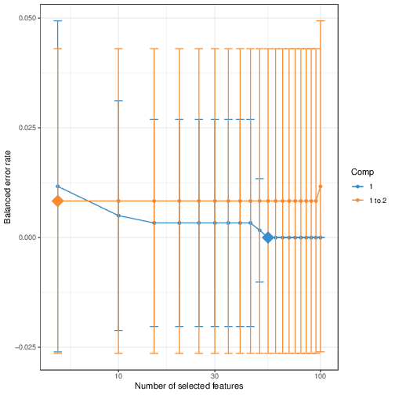

Case study 3
================

> **NOTE**: The pipeline API has changed since the original publication. To reproduce the results in the original COVID-19 paper for case study 1 and 2, please use the specific version of the pipeline available on zenodo only. Please refer to case study 3 for latest usage.

-   [1 Index](#index)
-   [2 Running the script](#running-the-script)
    -   [2.1 Load data](#load-data)
    -   [2.2 Run script](#run-script)
-   [3 Input data](#input-data)
    -   [3.1 Biological context](#biological-context)
    -   [3.2 Summary](#summary)
    -   [3.3 Metadata](#metadata)
    -   [3.4 Data](#data)
-   [4 Input data](#input-data-1)
-   [5 Data quality control](#data-quality-control)
    -   [5.1 Accounting for missing
        values](#accounting-for-missing-values)
    -   [5.2 Accounting for unwanted
        variation](#accounting-for-unwanted-variation)
-   [6 Single omics analyses](#single-omics-analyses)
    -   [6.1 Parameter tuning](#parameter-tuning)
    -   [6.2 Running the analysis](#running-the-analysis)
    -   [6.3 Explanation of output](#explanation-of-output)
-   [7 Multi omics analyses](#multi-omics-analyses)
    -   [7.1 Parameter tuning](#parameter-tuning-1)
    -   [7.2 Running the analysis](#running-the-analysis-1)
    -   [7.3 Explanation of output](#explanation-of-output-1)
-   [8 Output data](#output-data)
-   [9 Acknowledgements](#acknowledgements)
-   [10 References](#references)

Copyright (c) 2020
<a href="https://orcid.org/0000-0002-9207-0385">Tyrone Chen
</a>,
<a href="https://orcid.org/0000-0002-4146-2848">Al J Abadi
</a>,
<a href="https://orcid.org/0000-0003-3923-1116">Kim-Anh Lê Cao
</a>,
<a href="https://orcid.org/0000-0003-0181-6258">Sonika Tyagi
</a>

Code in this package and git repository
<https://github.com/tyronechen/SARS-CoV-2/> is provided under a [MIT
license](https://opensource.org/licenses/MIT). This documentation is
provided under a [CC-BY-3.0 AU
license](https://creativecommons.org/licenses/by/3.0/au/).

[Visit our lab website here.](https://bioinformaticslab.erc.monash.edu/)
Contact Sonika Tyagi at <sonika.tyagi@monash.edu>.

# 1 Index

-   [Introduction](introduction.md)
-   [Case study 1](case_study_1.md)
-   [Case study 2](case_study_2.md)
-   [Case study 3](case_study_3.md)

# 2 Running the script

Load the library.

``` r
library(multiomics)
```

A script to reproduce our analysis for case study 3 is shown. [You can
also download this
here](https://gitlab.com/tyagilab/sars-cov-2/-/raw/master/src/case_study_3/example.sh).
This may take few hours to run (if tuning is performed).

## 2.1 Load data

The data is extracted from the `RData` object to generate the input files. Script takes files as input only.

```
> library(multiomics)
> data(BPH2819)
> names(BPH2819)
[1] "classes"       "metabolome"    "proteome"      "transcriptome"
> export <- function(name, data) {write.table(data.frame(data), paste(name, ".tsv", sep=""), quote=FALSE, sep="\t", row.names=TRUE, col.names=NA)}
> mapply(export, names(BPH2819), BPH2819, SIMPLIFY=FALSE)
```

## 2.2 Run script

This runs the pipeline from end to end and generates all the results
which are shown below. The code blocks below show each step if you want
to perform them manually.

```
Rscript run_pipeline.R \
  --classes classes.tsv \
  --data metabolome.tsv \
         proteome.tsv \
         transcriptome.tsv \
  --data_names metabolome proteome transcriptome \
  --ncpus 2 \
  --icomp 12 \
  --pcomp 10 \
  --plsdacomp 2 \
  --splsdacomp 2 \
  --diablocomp 2 \
  --dist_plsda "centroids.dist" \
  --dist_splsda "centroids.dist" \
  --dist_diablo "centroids.dist" \
  --cross_val "Mfold" \
  --cross_val_folds 5 \
  --cross_val_nrepeat 50 \
  --corr_cutoff 0.1 \
  --outfile_dir BPH2819 \
  --contrib "max" \
  --progress_bar
```

# 3 Dataset

## 3.1 Biological context

This dataset contains three omics data: metabolome, proteome
and transcriptome. There are 6 biological replicates for 2 sample
types: sepsis-causing bacteria grown on RPMI growth media as a 
control and sepsis-causing bacteria obtained from human sera. 
The original publication with the source data is here:

-   [Mu, A., Klare, W.P., Baines, S.L. et al. Integrative omics identifies conserved and pathogen-specific responses of sepsis-causing bacteria. Nat Commun 14, 1530 (2023)](https://doi.org/10.1038/s41467-023-37200-w)

## 3.2 Summary

The data used as input to this pipeline available in gitlab:

-   [classes](https://github.com/tyronechen/SARS-CoV-2/blob/master/multiomics/data/classes.tsv)
-   [metabolome](https://github.com/tyronechen/SARS-CoV-2/blob/master/multiomics/data/metabolome.tsv)
-   [proteome](https://github.com/tyronechen/SARS-CoV-2/blob/master/multiomics/data/proteome.tsv)
-   [transcriptome](https://github.com/tyronechen/SARS-CoV-2/blob/master/multiomics/data/transcriptome.tsv)

## 3.3 Metadata

The `classes.tsv` sample information file is loaded as a vector:

```
BPH2819$classes
> [1] "RPMI" "RPMI" "RPMI" "RPMI" "RPMI" "RPMI"
> [6] "Sera" "Sera" "Sera" "Sera" "Sera" "Sera"
```

No repeated measurements were known to be carried out.

## 3.4 Data

The metabolome, proteome and transcriptome data have 100
matched samples and an arbitrary number of features.

# 4 Input data

For reference, you can also access all these loaded data below and
results in the `RData` object. Data objects in both this walkthrough and
the `RData` object have identical names. The code blocks in this
walkthrough will reproduce the same data structures. Not all values may
be identical since some functions may be non-deterministic. This is true
even if a seed is specified, since `R >=3.6` these are not reproducible
across machines.

<details>
<summary>
Click to expand code block
</summary>

``` r
  url_rdata <- "https://github.com/tyronechen/SARS-CoV-2/blob/master/results/case_study_3/data.RData"
  download.file(url_rdata, "data.RData")
  load("data.RData")
  ls()
 [1] "argpath"               "argv"                  "classes"
 [4] "contrib"               "corr_cutoff"           "data"
 [7] "data_imp"              "data_names"            "data_pca_multilevel"
[10] "data_plsda"            "data_splsda"           "design"
[13] "diablo"                "diablo_input"          "diablo_keepx"
[16] "diablo_ncomp"          "dimensions"            "dist_diablo"
[19] "dist_plsda"            "dist_splsda"           "heatmaps"
[22] "i"                     "input_data"            "linkage"
[25] "low_var"               "mappings"              "missing"
[28] "optimal_params"        "optimal_params_values" "outdir"
[31] "paths"                 "pca_impute"            "pca_withna"
[34] "pch"                   "perf_diablo"           "plot"
[37] "plsda_ncomp"           "rdata"                 "splsda_keepx"
[40] "splsda_ncomp"          "tuned_diablo"          "tuned_splsda"
[43] "x"                     "y"
```

> **NOTE**: There are some differences in the R data object for case
> studies 1 and 2. Case study 1 was originally performed using an early
> version of the code. It has since been streamlined for case study 2,
> which contains more information. However, both analyses are
> reproducible and the user can if needed further investigate the
> internal data structures after loading them.

> **NOTE**: The pipeline API has changed since the original publication. To reproduce the results in the original COVID-19 paper for case study 1 and 2, please use the specific version of the pipeline available on zenodo only.

</details>

For case study 1 and 2, it is not recommended to run the pipeline directly
because of resource usage. This may take more than a day on 16 cpus.
Instead, we use the `RData` object created as a result and load data
from there directly to skip long-running steps. In those cases, we
provide the code for reference only.

Obtain the input data from the git repository.

<details>
<summary>
Click to expand code block
</summary>

Data is included within the package by default. For demonstration purposes we extract the data into files, as the pipeline takes files as input.

``` r
library(multiomics)
data(BPH2819)
names(BPH2819)
export <- function(name, data) {
  write.table(
    data.frame(data), 
    paste(name, ".tsv", sep=""), 
    quote=FALSE, sep="\t", 
    row.names=TRUE, 
    col.names=NA
    )
  }
mapply(export, names(BPH2819), BPH2819, SIMPLIFY=FALSE)'
```

If the above dooes not work, you can also download the data directly.

``` r
  url_class <- "https://github.com/tyronechen/SARS-CoV-2/blob/master/multiomics/data/classes.tsv"
  url_meta <- "https://github.com/tyronechen/SARS-CoV-2/blob/master/multiomics/data/metabolome.tsv"
  url_prot <- "https://github.com/tyronechen/SARS-CoV-2/blob/master/multiomics/data/proteome.tsv"
  url_tran <- "https://github.com/tyronechen/SARS-CoV-2/blob/master/multiomics/data/transcriptome.tsv"
  
  urls <- c(url_class, url_meta, url_prot, url_tran)
  file_names <- sapply(strsplit(urls, "/"), tail, 1)
  mapply(function(x, y) download.file(x, y), urls, file_names, SIMPLIFY=FALSE)
  if (any(file.exists(file_names)) != TRUE) {stop("Files incorrectly downloaded!")}
```

</details>

Load the data and metadata with the following functions. All files must
be in the same order!

<details>
<summary>
Click to expand code block
</summary>

Using the pipeline:

``` r
paths <- c("metabolome.tsv", "proteome.tsv", "transcriptome.tsv")
classes <- parse_classes("classes.tsv")
data <- lapply(paths, parse_data, missing_as=NA, rmna=TRUE)
# these must be unique
data_names <- c("metabolome", "proteome", "translatome")
# design matrix specifying linkage across blocks (for multiomics)
design <- create_design(data, 0.1)
```

Using the R data object:

``` r
load("RData.RData")
classes
[1] "RPMI" "RPMI" "RPMI" "RPMI" "RPMI" "RPMI"
[6] "Sera" "Sera" "Sera" "Sera" "Sera" "Sera"
sapply(data, dim)
$metabolome
[1]  12 153
$proteome
[1]   12 1451
$transcriptome
[1]   12 2771
design <- create_design(data, 0.1)
```

</details>

# 5 Data quality control

Before analysing data further we perform standard checks for common
quality issues.

## 5.1 Accounting for missing values

We discovered a small proportion of missing values within the
data. Missing values in data can bias analyses. There are
multiple ways to address this. In our case we use imputation.

<details>
<summary>
Click to expand code block
</summary>

``` r
# the sample data object is already been cleaned
# we show steps for reference only
# we previously already downloaded this file in above step  
unimputed_path <- "metabolome.tsv"
unimputed <- read.table(unimputed_path, sep="\t", header=TRUE, row.names=1)
unimputed[unimputed == 0] <- NA
na_prop_tran <- show_na_prop(unimputed, "Metabolome")
```

<!-- -->
</details>
<details>
<summary>
Click to expand code block
</summary>

Using the pipeline:

``` r
data <- lapply(data, remove_na_class, classes)
```

</details>

We corrected for the missing values in the data by imputation with the 
NIPALS algorithm, effective on data with &lt; 20% missing values.
We considered that the proportion of missing values are low in each 
data block and imputation would be effective. Note that imputation 
can take some time, increasing with data size and component count.

<details>
<summary>
Click to expand code block
</summary>

Using the pipeline:

``` r
# this step is important, some functions use the names internally
names(data) <- data_names
data_imp <- impute_missing(data, rep(10, length(data)), outdir="./")
```

</details>

> **NOTE**: This step also writes out the imputed, un-replaced data.
> Since imputation can take some time, this is mainly for convenience.
> You can then load the imputed data directly as input in future steps
> if it meets your requirements.

To test that imputation has not introduced significant technical
variation into the data, we observe the correlation between variates of
the principal components.

> **NOTE**: All PCAs are centered and scaled.

<details>
<summary>
Click to expand code block
</summary>

Using the pipeline (if data is imputed internally):

``` r
pca_imputed <- mixOmics::pca(data$transcriptome, ncomp=10)
pca_unimputed <- mixOmics::pca(unimputed, ncomp=10)
cor_imputed_unimputed_(pca_imputed, pca_unimputed, "Transcriptome")
[1] "Plotting correlation between unimputed and imputed components"
```

<!--  -->

Using the R Data object:

To improve efficiency during code run, a imputed data file was generated
as output in the first run of the pipeline. This was then used in
subsequent runs of the pipeline as direct input.
</details>

In this case, there is a strong correlation between the variates on at
least the first 5 principal components corresponding to at least 50% of
the variation in the data.

## 5.2 Review single omics data

Examine the distribution of the data:

<details>
<summary>
Click to expand code block
</summary>


</details>

We examine the data with PCA:

<details>
<summary>
Click to expand code block
</summary>


</details>

## 5.3 Accounting for unwanted variation

The experimental design of this study contains no repeated measurements
on the same sample. There is also no known variation from batch effects.
To see an older example of this, please refer to case study 1.

# 6 Single omics analyses

> **NOTE**: In all cases, where number of components are lower than 3,
> some plots will be omitted due to plotting limitations. This does not
> mean the results are incorrect.

We next apply the PLSDA (Partial Least Squares Discriminant Analysis)
and sPLSDA (sparse variant of PLSDA) method for each block of
single-omics data, and as before internally perform a multilevel
decomposition to account for the repeated measurements within each cell
culture.

## 6.1 Parameter tuning

To investigate the parameters best suited for the methods, M-fold
cross validation was performed. The number of components and features
selected were tuned internally with a function in the mixOmics package.

<details>
<summary>
Click to expand code block
</summary>

Using the pipeline on all features (PLSDA):


In this example, results for only one omics data is shown.

</details>


<details>
<summary>
Click to expand code block
</summary>

Using the pipeline:

``` r
# this step can take some time
data_plsda <- classify_plsda(
  data=data, classes=classes, pch=pch, title=data_names,
  ncomp=2, contrib="max", outdir="./",
  mappings=NULL, dist="centroids.dist", bg=TRUE
)
```

Using the R data object:

``` r
lapply(data_plsda, names)
$metabolome
[1] "data_plsda" "perf_plsda"
$proteome
[1] "data_plsda" "perf_plsda"
$transcriptome
[1] "data_plsda" "perf_plsda"
```

</details>

We also run sPLSDA on selected features for comparison. 

Unlike PLSDA, we tune the number of selected features. Using the pipeline:

<details>
<summary>
Click to expand code block
</summary>

``` r
# this step can take some time
tuned_splsda <- tune_splsda(
  data, classes, data_names, multilevel=NULL, ncomp=2, nrepeat=50,
  logratio="none", test_keepX=c(5, 10, 15, 20), validation="Mfold", folds=5,
  dist="centroids.dist", cpus=1, progressBar=FALSE
)
splsda_keepx <- lapply(tuned_splsda, `[`, "choice.keepX")
splsda_ncomp <- lapply(tuned_splsda, `[`, "choice.ncomp")

print("Tuned splsda to use number of components:")
splsda_ncomp <- lapply(splsda_ncomp, `[`, "ncomp")
splsda_ncomp <- unlist(splsda_ncomp, recursive=FALSE)
names(splsda_ncomp) <- data_names
print(splsda_ncomp)

print("Tuned the number of variables selected on each component to:")
print(splsda_keepx)
splsda_keepx <- unlist(splsda_keepx, recursive=FALSE)
names(splsda_keepx) <- data_names
print(splsda_keepx)
```

Using the R data object:

``` r
names(tuned_splsda)
 [1] "metabolome"    "proteome"      "transcriptome"

keep optimal number of features to keep
splsda_keepx <- lapply(tuned_splsda, `[`, "choice.keepX")
splsda_keepx <- unlist(splsda_keepx, recursive=FALSE)
names(splsda_keepx) <- data_names
```


In this example, results for only one omics data is shown.

</details>

## 6.2 Running the analysis

With the tuned parameters, we run sPLSDA (subset of features).

<details>
<summary>
Click to expand code block
</summary>

Using the pipeline:

``` r
# this step can take some time
data_splsda <- classify_splsda(
  data=data, classes=classes, pch=pch, title=data_names,
  ncomp=splsda_ncomp, keepX=splsda_keepx, contrib="max", outdir="./",
  mappings=NULL, dist="centroids.dist", bg=TRUE
)
```

Using the R data object:

``` r
lapply(data_splsda, names)
$metabolome
[1] "data_splsda" "perf_splsda"

$proteome
[1] "data_splsda" "perf_splsda"

$transcriptome
[1] "data_splsda" "perf_splsda"
```





In this example, results for only one omics data is shown.

</details>

These automatically generate a large series of plots. Figures are
ordered sequentially by each block of omics data in `data_name`, in this
case `metabolome`, `proteome`, followed by `transcriptome`.
Some `txt` files containing feature loadings are also written to the
output directory.

## 6.3 Explanation of output

Detailed technical information on the individual figures types and
underlying methods are available at the [mixOmics
website](http://mixomics.org/). This walkthrough will explain the plots
in context of the biological system under study only. The plots are
explained in the order that they appear in this document.

### 6.3.1 Scatter plots

Plotting the first few components of the sPLSDA reveals a clear 
separation of phenotypes from RPMI media grown to human sera.

These will be conceptually similar to PLSDA, the only difference is
that a subset of features are used. Only displayed if number of
components are more than 1.

### 6.3.2 Classification error

> **NOTE**: Balanced error rate can be used in cases where classes are
> imbalanced.

To show accuracy of the method, the classification error rate across
multiple components for maximum, centroids and mahalanobis distance are
plotted. The centroids distance metric appeared to perform the best in
this case, with the lowest error rate after 1 component.

### 6.3.3 Feature stability

To assess how stable the feature is across cross-validation, each of the
horizontal bars represent a feature. The height of the bar corresponds
to stability. For each omics data, we observe a subset of highly stable 
features and a subset of highly unstable features.

<details>
<summary>
Click to expand code block
</summary>


</details>

### 6.3.4 ROC curves

As a supplementary layer of validation, ROC curves showing
classification accuracy are available, but we note that these have
limited applicability given the specific context of the method. The
underlying method already internally specifies the prediction cutoff to
achieve maximal sensitivity and specificity.

<details>
<summary>
Click to expand code block
</summary>


</details>

### 6.3.5 Arrow plots

Arrow plots were previously available. Now only implemented for the 
following objects: pls, plsda, spls, splsda, rcc, sgcca, sgccda, rgcca.

### 6.3.6 Clustered image maps

To investigate the relationship between samples, these plots can be
interpreted like heatmaps. They are coloured by biological class as well
as batch information. Individual components can be extracted for custom
visualisation if needed.

<details>
<summary>
Click to expand code block
</summary>


</details>

### 6.3.7 Variable loadings

To understand how much a feature contributes to the biological
classification, loading weights are shown. Direction of the bar
indicates the abundance of that feature in the data (left for less,
right for more). Bars are colour coded to biological class. Individual
components can be extracted for custom visualisation if needed.

Note that only a subset of these features are visualised. The full list
is exported into a tab-separated `txt` file, functionally similar to 
that from a `limma` differential expression analysis.

<details>
<summary>
Click to expand code block
</summary>


</details>

### 6.3.8 PLSDA

To supplement the sPLSDA, we also compared the performance of PLSDA (a
non sparse variant of sPLSDA keeping all features). This showed
similarities in patterns across the datasets. The plots are conceptually
identical, but several plots are excluded as they are not applicable
(feature selection, variable stability).

# 7 Multi omics analyses

> **NOTE**: In all cases, where number of components are lower than 3,
> some plots will be omitted due to plotting limitations. This does not
> mean the results are incorrect.

Having assessed the major sources of variation and features of interest
contributing to biological conditions within the individual blocks of
omics data, we can use this information to guide our multi-omics
integration.

We applied a latent variable approach to identify a highly correlated
multi-omics signature. This analysis is carried out in a conceptually
similar way to the previous sPLSDA with similar parameter requirements,
except with multiple omics data blocks corrected for longitudinal study
effects specified as input. We illustrate the correlation between
features across these omics blocks with a circos plot.

## 7.1 Parameter tuning

To investigate the parameters best suited for the methods, leave-one-out
cross validation was performed. Similar to sPLSDA, the number of
components and features selected were tuned internally with a function
in the mixOmics package.

<details>
<summary>
Click to expand code block
</summary>

Using the pipeline:

``` r
# tune number of components
tuned_diablo <- tune_diablo_ncomp(data, classes, design, ncomp=diablo_ncomp, cpus=1)
print("Parameters with lowest error rate:")
diablo_ncomp <- tuned_diablo$choice.ncomp$WeightedVote["Overall.BER", "centroids.dist"]
diablo_ncomp <- as.list(diablo_ncomp, length(data_names))
names(diablo_ncomp) <- data_names
diablo_ncomp <- diablo_ncomp[which.max(diablo_ncomp)]
print("Number of components:")
print(diablo_ncomp)

# tune keepx
diablo_keepx <- tune_diablo_keepx(
  data, classes, 5, design, diablo_keepx, cpus=2, 
  dist="centroids.dist", progressBar=TRUE, validation="Mfold", 
  folds=5, nrepeat=50)
print("Diablo keepx:")
print(diablo_keepx)
```

Using the R object:

``` r
> diablo_keepx
$Metabolomics_GC_MS
[1] 5
$Proteomics_MS1_DDA
[1] 5
$RNA_Seq
[1] 5
```


</details>

## 7.2 Running the analysis

With the tuned parameters, we run multi-block sPLSDA (DIABLO).

<details>
<summary>
Click to expand code block
</summary>

Using the pipeline:

``` r
> diablo_ncomp
[1] 1
> diablo_keepx
$Metabolomics_GC_MS
[1] 5
$Proteomics_MS1_DDA
[1] 5
$RNA_Seq
[1] 5
# run the algorithm
diablo <- run_diablo(data, classes, diablo_ncomp, design, diablo_keepx)
```

Using the R data object:

``` r
diablo

Call:
 block.splsda(X = data, Y = classes, ncomp = ncomp, keepX = keepx, design = design, near.zero.var = near_zero_var)

 sGCCA with 1 components on block 1 named Metabolomics_GC_MS
 sGCCA with 1 components on block 2 named Proteomics_MS1_DDA
 sGCCA with 1 components on block 3 named RNA_Seq
 sGCCA with 1 components on the outcome Y

 Dimension of block 1 is  12 153
 Dimension of block 2 is  12 1451
 Dimension of block 3 is  12 2771
 Outcome Y has 2 levels

 Selection of 5 variables on each of the sGCCA components on the block 1
 Selection of 5 variables on each of the sGCCA components on the block 2
 Selection of 5 variables on each of the sGCCA components on the block 3

 Main numerical outputs:
 --------------------
 loading vectors: see object$loadings
 variates: see object$variates
 variable names: see object$names

 Functions to visualise samples:
 --------------------
 plotIndiv, plotArrow, cimDiablo, plotDiablo

 Functions to visualise variables:
 --------------------
 plotVar, plotLoadings, network, circosPlot

 Other functions:
 --------------------
 selectVar, perf, auc
```


</details>

## 7.3 Explanation of output

Many of these plots can be interpreted in conceptually similar ways to
that of the single-omic sPLSDA above. However, some extra plots are
created to better illustrate correlation between datasets.

> **NOTE**: As usual, the full list of plots and results are available
> in the git repository.

### 7.3.1 Classification error

> **NOTE**: Balanced error rate can be used in cases where classes are
> imbalanced.

To show accuracy of the method, the classification error rate across
multiple components for maximum, centroids and mahalanobis distance are
plotted. The centroids distance metric appeared to perform the best in
this case, with the lowest error rate after 3 components for proteome
and 4 for translatome.

<details>
<summary>
Click to expand code block
</summary>

``` r
# assess performance
perf_diablo <- mixOmics::perf(diablo, validation="Mfold", folds=5, nrepeat=50, auc=TRUE, cpus=1, progressBar=TRUE)

Performing repeated cross-validation with nrepeat = 50...
  |======================================================================| 100%
plot(perf_diablo)
```


</details>

### 7.3.2 Feature stability

To assess how stable the feature is across cross-validation, each of the
horizontal bars represent a feature. The height of the bar corresponds
to stability. We observe three subsets of highly stable features,
moderately stable features and less stable features.

<details>
<summary>
Click to expand code block
</summary>

``` r
mapply(
  function(x, y) plot(
    x$comp1, type="h", main="Comp 1", las=2,
    ylab="Stability", xlab="Features", xaxt="n"),
  perf_diablo$features$stable$nrep1,
  c("Metabolome", "Proteome", "Transcriptome")
)
```


</details>

### 7.3.3 Correlation plot

A correlation score is provided per block of omics data.

<details>
<summary>
Click to expand code block
</summary>

``` r
# to keep the case study concise we use a custom function to output main plots
mixOmics::plotDiablo(diablo, ncomp=1)
```


</details>

### 7.3.4 Scatter plots

Plotting the first few components of the multi-block sPLSDA (DIABLO)
reveals a spectrum of phenotypes from less severe to more severe, with a
degree of overlap.

<details>
<summary>
Click to expand code block
</summary>

``` r
# to keep the case study concise we use a custom function to output main plots
mixOmics::plotIndiv(
  diablo, ind.names=FALSE, legend=TRUE, title='DIABLO', ellipse=TRUE
)
```


</details>

### 7.3.5 ROC curves

As a supplementary layer of validation, ROC curves showing
classification accuracy are available, but we note that these have
limited applicability given the specific context of the method. The
underlying method already internally specifies the prediction cutoff to
achieve maximal sensitivity and specificity.

<details>
<summary>
Click to expand code block
</summary>

``` r
# roc curves are automatically generated for each data block and component
mixOmics::auroc(diablo)
# this also applies to plsda and splsda
```

</details>

### 7.3.6 Arrow plots

To review agreement between matching data sets, we use an arrow plot.
Short arrows suggest a strong similarity, while long arrows indicate
dissimilarity. There appears to be a spectrum of phenotypes from less
severe to more severe, with a degree of overlap.

<details>
<summary>
Click to expand code block
</summary>

``` r
# note that this only works if the number of components are at least 2
# here the number of optimal components is 1, so this will not work
# but we give an example for reference
mixOmics::plotArrow(diablo, ind.names=FALSE, legend=TRUE, title='DIABLO')

```

<!--  -->
</details>

### 7.3.7 Correlation circle plots

The correlation circle plots highlight the contribution of each variable
to each component. A strong correlation between variables is indicated
by clusters of points.

<details>
<summary>
Click to expand code block
</summary>

``` r
# to keep the case study concise we use a custom function to output main plots
mixOmics::plotVar(diablo, style='graphics', legend=TRUE, comp=c(1,2),
  title="DIABLO 1/2", var.names=FALSE
)
```

<!--  -->
</details>

### 7.3.8 Clustered image maps

To investigate the relationship between samples, these plots can be
interpreted like heatmaps. They are coloured by biological class as well
as batch information. Individual components can be extracted for custom
visualisation if needed.

<details>
<summary>
Click to expand code block
</summary>

``` r
# to keep the case study concise we use a custom function to output main plots
mixOmics::cimDiablo(diablo, size.legend=0.5, col.names=FALSE)
```


</details>

### 7.3.9 Variable loadings

To understand how much a feature contributes to the biological
classification, loading weights are shown. Direction of the bar
indicates the abundance of that feature in the data (left for less,
right for more). Bars are colour coded to biological class. Individual
components can be extracted for custom visualisation if needed.

Note that only a subset of these features are visualised. The full list
is exported into a tab-separated `txt` file, similar to that from a
`limma` differential expression analysis.

<details>
<summary>
Click to expand code block
</summary>

``` r
# to keep the case study concise we use a custom function to output main plots
mixOmics::plotLoadings(diablo, contrib="max", comp=1, max.name.length=6,
  method='median', ndisplay=20, size.name=0.6,
  size.legend=0.6, title=paste("DIABLO max loadings")
)
```


</details>

### 7.3.10 Circos plot

To visualise correlations between different blocks of omics data, a
circos plot is generated. The blue block represents lipidome data, the
green block represents metabolome data, the red block represents
proteome data and the orange block represents transcriptome data. Each
point on the circle is a single feature. Lines linking features show
correlations between features that pass the user-specified correlation
threshold, in this case 0.8. Red lines indicate positive correlation and
blue lines negative correlation.

<details>
<summary>
Click to expand code block
</summary>

``` r
# to keep the case study concise we use a custom function to output main plots
mixOmics::circosPlot(
  diablo, cutoff=0.8, line=FALSE, size.legend=0.5, size.variables=0.001
)
```


</details>

### 7.3.11 Network plot

Similar to the circos plot, a network plot can be generated. It is
compatible with cytoscape and can be exported as a `gml` file.

<details>
<summary>
Click to expand code block
</summary>

``` r
# to keep the case study concise we use a custom function to output main plots
# in this example only 2 blocks are shown
mixOmics::network(
  diablo, blocks=c(1,2), color.node=c('darkorchid','lightgreen'), cutoff=0.4,
  col.names=FALSE, row.names=FALSE
)
```


</details>

# 8 Output data

Files output by the pipeline include:

-   a `pdf` file of all plots generated by the pipeline
-   tab-separated `txt` files containing feature contribution weights to
    each biological class
-   tab-separated `txt` file containing correlations between each omics
    data block

[A `RData` object with all input and output is available in the git
repository.](https://github.com/tyronechen/SARS-CoV-2/blob/master/results/case_study_3/data.RData)
This is not included directly in the `multiomics` package because of
size constraints, and includes data from three omics datasets.

# 9 Acknowledgements

[Please refer to introduction.](introduction.md)

# 10 References

[Please refer to introduction.](introduction.md)
